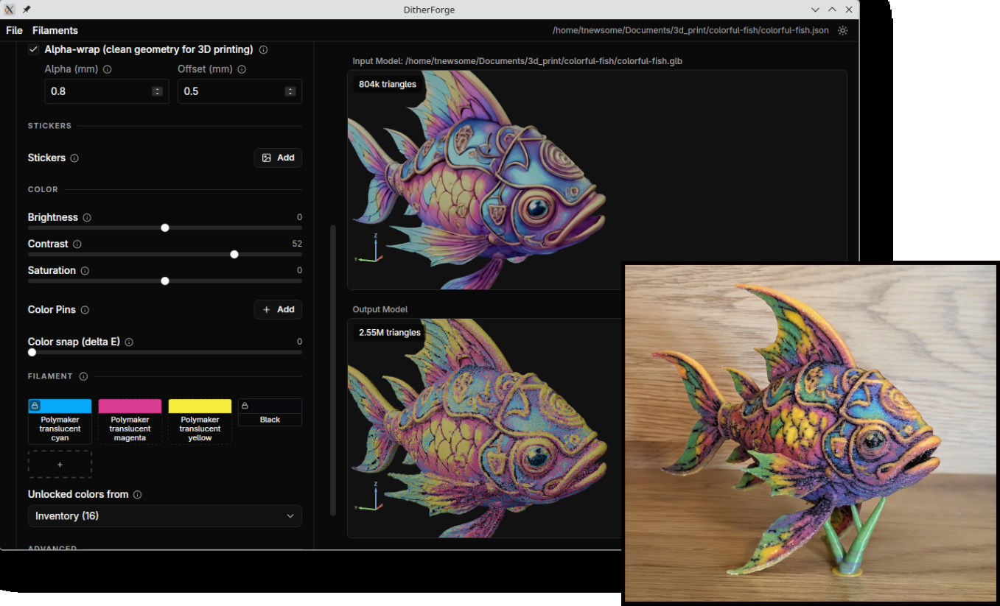

# DitherForge



Convert textured 3D models (GLB, 3MF, STL, OBJ, or COLLADA) into multi-color 3D-printable files
(3MF) for multi-filament printers.

## Download

Pre-built binaries for Linux, Windows, and macOS are available on the
[Releases](https://github.com/rtwfroody/ditherforge/releases) page.

## Quick Start

1. Launch `ditherforge`
2. Use **File > Open** to select a `.glb`, `.3mf`, `.stl`, `.obj`, or `.dae`
   (COLLADA) file (an OBJ or COLLADA model packaged in a `.zip` alongside its
   `.mtl`/textures also works)
3. Set **Nozzle diameter** and **Layer height** to match your slicer
4. Set **Size (mm)** to your target print size
5. Optionally, open the **Stickers** panel to apply PNG or JPEG images onto the model surface
6. Optionally, open the **Split** panel to cut the model in two halves that print side-by-side and assemble with pegs
7. Adjust the palette and color settings — the output preview updates automatically
8. Use **File > Export 3MF** to save the result (defaults to `<input>.3mf`)
9. Open the exported 3MF in OrcaSlicer or BambuStudio and print

All sidebar sections are collapsible — click a section header to fold or expand it.

**File > Open Recent** lists both recently opened models and recently used JSON settings files.

For real use, you'll want to update your Inventory filament collection as
described right below.

---

## How to Manage Filament Collections

The **Filaments** menu lists all available filament collections. Click a
collection name to open its editor.

In the collection editor you can:

- Add, edit, or remove colors (click a swatch to change its hex or label)
- Delete the collection

Use **Filaments > Import...** to load a collection from a plain-text file.
Each line must be in the format `#RRGGBB Label`, for example:

```
#FF0000 Red
#00FF00 Green
#0000FF Blue
```

Use **Filaments > New...** to create an empty collection and add colors
manually.

A built-in **Panchroma Basic** collection (28 colors) is included and cannot
be deleted.

## How to Set Print Dimensions

Use **Size (mm)** to scale the model so its largest extent matches the given
value. For example, set `100` to make the model 100 mm wide (or tall, whichever
is larger).

Use **Scale** mode for a relative multiplier instead. Toggle between Size and
Scale using the radio buttons above the input field.

## How to Set Nozzle and Layer Height

Set **Nozzle diameter** and **Layer height** in the settings panel to match the
values you will use in your slicer. These control the voxel grid resolution:

- The first layer uses wider voxels (`nozzle × 1.275`) to ensure full coverage
  and prevent the slicer from dropping thin features.
- Upper layers use narrower voxels (`nozzle × 1.05`) for finer color detail.

The default values are 0.4 mm nozzle and 0.20 mm layer height.

## How to Select an Object in a Multi-Object File

3MF and GLB files can contain multiple objects. When a file has more than one,
an **Object** dropdown appears in the settings panel. Choose **All objects** to
process the entire file together, or pick a specific object to work with it
alone. STL files always contain a single mesh and do not show this control.

## How to Set a Base Color for Untextured Faces

Meshes sometimes have faces without a texture or vertex color (common in STL
files and in some 3MF files). By default these faces render as plain white.
The **Base color** section of the settings panel offers two modes:

- **Solid** — pick a single color from any of your filament collections.
  This acts as the "paint" applied to any face that has no other color
  assigned, before dithering and palette selection.
- **Texture** — load a [MaterialX](https://materialx.org/) shader graph
  (`.mtlx` file, or a `.zip` archive containing the `.mtlx` and its
  textures) and apply it as a procedural or image-backed pattern. Procedural
  graphs (marble, brick, conditional banding such as rainbow stripes) are
  sampled per voxel in 3D, so the pattern looks carved-from-the-block rather
  than projected. Image-backed PBR packs
  (Quixel, AmbientCG, …) are projected via triplanar mapping, so they wrap
  cleanly across faces without requiring authored UVs on the mesh.

  Two knobs appear once a file is loaded:

  - **Tile size (mm)** — the object-space distance one shading-unit cycle
    of the procedural maps to. For image packs this is also the texture's
    repeat distance. Smaller = denser pattern.
  - **Triplanar** — sharpness of the triplanar projection blend for
    image-backed graphs. `1` is a soft cosine blend; higher values approach
    a hard box map. Ignored by purely procedural graphs that don't read
    texture coordinates.

  Try the official [`standard_surface_marble_solid.mtlx`](https://github.com/AcademySoftwareFoundation/MaterialX/blob/main/resources/Materials/Examples/StandardSurface/standard_surface_marble_solid.mtlx)
  for a procedural example, or grab a free image-backed pack from
  [GPUOpen MatLib](https://matlib.gpuopen.com/main/materials/all) or
  [AmbientCG](https://ambientcg.com/) and feed in its `.zip` directly.
  Only the graph's `base_color` output is consumed — normal maps,
  roughness, etc. are ignored, and only RGB is baked into the print.

## How to Configure the Color Palette

The palette grid shows all color slots. Each slot is either:

- **Locked** (solid border, lock icon) — a specific filament you have chosen
- **Unlocked** (dashed border) — filled automatically from the active filament
  collection

Click a slot to open the collection picker and choose a filament color. This
locks the slot to that color. To unlock it and return it to auto, click the
lock icon in the top-left corner of the swatch.

Add slots with the **+** button (up to 16). Remove a slot with the **×** button
that appears on hover. The number of slots is the total number of filaments
used in the output.

### Unlocked colors

Unlocked slots are filled with the best-matching colors from the filament
collection selected under **Unlocked colors from**. Locked colors are taken
into account, so auto-selected colors complement rather than duplicate them.

Use **Filaments** in the menu bar to manage collections. See [Managing Filament
Collections](#how-to-manage-filament-collections).

## How to Adjust Colors

Three sliders adjust the model's colors before palette selection:

- **Brightness** — lighten or darken (-100 to +100, default 0)
- **Contrast** — increase or reduce contrast (-100 to +100, default 0)
- **Saturation** — increase or reduce color intensity (-100 to +100, default 0)

The input preview reflects these adjustments instantly via GPU shaders. The
output re-renders with each change.

## How to Use Stickers

Stickers let you apply PNG or JPEG images directly onto the model surface
before voxelization. As you drag the cursor over the model while placing, a
floating billboard preview shows exactly where the sticker will sit.

To place a sticker:

1. Open the **Stickers** panel in the sidebar.
2. Click **Add** and choose a PNG or JPEG file. A thumbnail appears in the
   panel and the app enters placement mode automatically.
3. Click a point on the input model. The sticker centers on that point,
   oriented to the surface. The input preview updates immediately to show the
   applied sticker.
4. Adjust **Scale**, **Rotation**, and **Mode** as needed.

### Sticker modes

Each sticker has two modes, selected with radio buttons:

- **Projection** (default) — projects the sticker along its normal, like a
  slide projector. The image lands on whatever front-facing surface is closest
  along the projection direction and does not wrap around corners. Works well
  on most shapes, including complex or non-developable geometry.
- **Unfold** — flood-fills from the clicked triangle across the mesh,
  unfolding each triangle into the sticker's tangent plane. The sticker wraps
  around curves following the surface. A **Surface bend limit** slider stops
  the flood-fill at sharp edges (0° = no limit). Best on developable patches
  (cylinders, cones, gentle curves).

There is no hard limit on the number of stickers. They are composited over the
base model color during voxelization and are affected by the brightness,
contrast, and saturation sliders like any other color on the model.

Sticker placements, scale, rotation, mode, and bend limit are saved and
restored with the JSON settings file.

## How to Use Color Pins

Color pins remap specific colors in the model before dithering. Use them to
correct individual colors without affecting the rest of the model — for example,
to shift a too-yellow green toward a truer green filament.

Each pin has:

- **Source color** — the color to replace, sampled from the input model or
  typed as `#RRGGBB`
- **Target color** — the filament color to map toward, chosen from a collection
- **Reach** — how far the adjustment spreads in color space (delta E units,
  default 5). Higher values affect a broader range of similar colors.

To sample a source color from the model, click the eyedropper icon on a pin
and then click a point on the input model preview. The color at that pixel is
captured as the source.

Up to 8 pins are supported. The pipeline uses Gaussian RBF interpolation in
CIELAB color space to blend multiple pin effects smoothly.

## How to Use Color Snap

**Color snap** shifts each voxel's color toward the nearest palette color before
dithering, by up to the configured delta E distance. This reduces noise in
regions that are nearly a single solid color.

Set the value with the **Color snap (delta E)** slider (0 to 50, default 5).
Set to 0 to disable.

## How to Choose a Dither Mode

The **Dither** panel selects how each voxel's pre-dither color is mapped onto
a palette color. Different modes trade global accuracy ("drift": does the
average output color match the average input?) against local pattern
("wander": how far from the nearest-input palette do picks reach?).

The dropdown offers:

- **Riemersma** — walks voxels along a locally-coherent tour and
  diffuses each cell's quantization error into a sliding window of recent
  cells. Preserves average color exactly (zero drift) and avoids the
  scanline directionality of Floyd-Steinberg.
- **Riemersma pair** — like Riemersma but scores each voxel jointly with its
  tour-neighbour and prefers picks whose residuals cancel. On a flat-gray
  area with a black/white palette this prefers `(black, white)` instead of
  the long `(black, black, white, white, …)` kick the single-cell version
  produces. Same drift as Riemersma; lower wander on flat/textured regions;
  slightly noisier on detailed near-palette images.
- **Blue noise** — picks the smallest palette simplex (pair, triangle, or
  full) that brackets each cell's input within a tolerance, then chooses
  among its vertices via a low-discrepancy sequence. Bounds wander tightly
  on uniform regions at the cost of a small global drift.
- **Dizzy** — randomized error-diffusion (Liam Appelbe's blue-noise dizzy,
  iterated three times with drift correction). Blue-noise look with no
  directional structure on flat areas.
- **Floyd-Steinberg** (default) — deterministic scanline order. Preserves
  average chroma exactly, but produces visible directional structure on flat
  areas.
- **none** — no dithering; each cell snaps to the nearest palette color.

When **Riemersma** or **Riemersma pair** is selected, an **Alpha** slider
appears (0..1, default 0.85). It's the per-cell input-bias maximum: pulls
each cell's pick toward its nearest-input palette when the cell is close to
a palette color. 0 = pure error-diffusion (zero drift but black/white
oscillation around near-grey input). Higher values suppress that
oscillation; ≥0.9 starts to posterize textured surfaces.

When **Blue noise** is selected, a **Tolerance** slider appears (default 20,
in 8-bit RGB units). Smaller (≈5–10) forces the dither to bracket each
input with more palette colors (lower drift, wider color spread on near-
flat regions). Larger (≈20–40) sticks to 2-color pairs (tighter wander
bounds, small per-cell drift).

## How to Split a Model into Two Halves

The **Split** panel cuts the model along an axis-aligned plane into two halves
that print separately and assemble back into the original. Both halves are
laid out side by side on the build plate, sitting flat on the cut face. Use
this when the model is taller than your build volume, when supports for an
overhang would otherwise be hard to remove, or when you want to paint each
half before assembly.

To split a model:

1. Open the **Split** panel and check **Split into two parts**. Alpha-wrap is
   forced on automatically — a clean cut needs a watertight input mesh.
2. Choose the **Cut plane** (XY, XZ, or YZ) and the **Offset** along that
   axis. The 3D viewer overlays a translucent quad showing the live cut
   position.
3. Pick a **Connector style**:
   - **Pegs** — a solid peg on one half mates with a matching pocket on the
     other. Best for FDM where dowel hardware isn't on hand.
   - **Dowel/magnet holes** — matching pockets on both halves; print
     or buy dowel pins, or glue in magnets for a magnetic catch.
   - **None** — flat cut, glue-only assembly.
4. Adjust **Count** (number of connectors along the cut; **Auto** picks 1, 2,
   or 3 based on the cut polygon's inscribed-circle radius), **Diameter**,
   **Depth**, **Clearance** (per-side radial gap on the female feature so
   the peg slides in), and **Bed gap** (space between the two halves on the
   plate) as needed.
5. Export the result with **File > Export 3MF** as usual. The exported file
   contains two build items, one per half, that the slicer treats as
   independent objects.

Stickers, color pins, and base color are applied to the original (unsplit)
mesh, so they survive the cut and appear on whichever half they land on.
Split panel state is saved and restored with the JSON settings file.

If you turn off **Alpha-wrap** while Split is enabled, Split is automatically
disabled as well. A toast explains the dependency.

## How to Save and Load Settings

Use **File > New** to reset every setting to its factory default — palette,
color pins, adjustments, dither mode, split, the lot. Useful when starting
fresh on a new model without manually undoing the previous session's
configuration. Anything missing from a settings file you load is treated
the same way: it falls back to its factory default rather than carrying over
from the previously loaded settings.

Use **File > Save JSON** to save all current settings — palette, color pins,
adjustments, size, and nozzle settings — to a JSON file.

Use **File > Save JSON As...** to save to a new file.

Use **File > Open** and select a `.json` file to restore all settings and
re-open the associated model.

Settings files are automatically associated with the input model. When you open
a model, DitherForge suggests a default settings path based on the model's
filename.

## How to Export a 3MF

Use **File > Export 3MF...** after the pipeline finishes (the output preview
is visible). The exported file includes per-face material assignments
compatible with OrcaSlicer and BambuStudio.

**File > Export 3MF** is disabled until the pipeline produces a valid output.

---

## How It Works

1. **Load** — reads a GLB, 3MF, STL, OBJ, or COLLADA file and scales it to millimeters. The
   model bottom is normalized to Z = 0. For files with multiple objects, the
   selected object (or all objects) is processed. The geometry mesh is then
   decimated to voxel resolution with QEM mesh decimation — detail finer than
   the voxel grid won't survive voxelization, so discarding it here keeps the
   downstream stages fast. The pristine mesh is kept separately for color
   sampling, so textures and per-face colors stay at full resolution.
2. **Stickers** — maps each sticker image onto the mesh. "Projection" mode
   (the default) projects the image along the sticker normal onto the
   frontmost surface; "Unfold" mode flood-fills from the placement point
   across mesh adjacency. Sticker colors are alpha-composited over the base
   texture.
3. **Split** (optional) — cuts the geometry mesh along the configured plane
   using CGAL's `Polygon_mesh_processing::clip`, bakes peg or dowel
   connectors into the cut faces via boolean ops, and lays the two halves
   side by side on the build plate. Color sampling stays in the original
   mesh's coordinate frame, so stickers, color pins, and base color
   survive the cut unchanged.
4. **Voxelize** — maps the model onto a grid of cells matching the nozzle and
   layer settings. Each cell gets the color sampled from the original texture
   (including any stickers). First-layer cells are wider (`nozzle × 1.275`);
   upper cells are narrower (`nozzle × 1.05`).
5. **Color adjust** — applies brightness, contrast, and saturation.
6. **Color warp** — applies color pin remappings using Gaussian RBF
   interpolation in CIELAB color space.
7. **Palette** — resolves locked colors, then selects auto colors from the
   active collection. Applies color snap to shift cell colors toward the palette.
8. **Dither** — assigns a palette color to each cell to approximate the original
   texture. The default `floyd-steinberg` mode assigns palette colors in a
   deterministic scanline order, preserving average chroma exactly. Five other
   modes are available — `riemersma`, `riemersma-pair`, `blue-noise`,
   `dizzy-corrected`, and `none` — each with different drift/wander/structure
   trade-offs. See [How to Choose a Dither Mode](#how-to-choose-a-dither-mode).
9. **Clip** — cuts the decimated mesh along voxel color boundaries and assigns
   each fragment a palette color.
10. **Merge** — merges coplanar triangles to reduce face count.
11. **Export** — writes a 3MF file with per-face material assignments. When
    Split is enabled, two `<object>` entries are emitted (one per half) so
    slicers see them as independent build items.

If **Alpha-wrap** is enabled (Advanced section), it runs inside the Load stage
to produce a watertight shell of the input mesh — the load-time decimation
feeds it a mesh already pruned to voxel resolution. Split also forces
alpha-wrap on, since the cut needs a watertight input.

Each stage is cached by its settings hash. Changing a downstream parameter
(e.g., dithering mode) skips all upstream stages on the next run. The stage
caches persist across app restarts on disk (zstd-compressed), so re-opening a
recent model is much faster than the first time — in particular the Load cache,
which now subsumes both decimation and alpha-wrap, the slowest upstream work.

While the pipeline runs, the output stage list shows live progress for each
stage along with cache hit/miss status. If a stage fails, the error message
appears as a final line in the list.

---

## CLI

`ditherforge-cli` provides the same pipeline from the command line, without a
GUI window. It accepts `.glb`, `.3mf`, `.stl`, `.obj`, and `.dae` (COLLADA)
inputs (plus an OBJ or COLLADA model packaged in a `.zip` with its
`.mtl`/textures).

```
ditherforge-cli model.glb --size 100
```

This loads `model.glb`, scales it to 100 mm, selects 4 colors from the default
palette, and writes `model.3mf` alongside the input.

Note: the CLI does not currently support stickers, color pins, splitting, or
multi-object selection. Use the GUI to configure those and save a JSON
settings file.

### Options

| Flag | Default | Description |
|------|---------|-------------|
| `--size` | — | Scale model so largest extent equals this value in mm |
| `--scale` | `1.0` | Scale multiplier (applied on top of unit conversion) |
| `-n` | `4` | Number of palette colors |
| `--color` | — | Lock a color (CSS name or `#RRGGBB`; repeatable, comma-separated) |
| `--inventory` | — | Filament inventory file (`#RRGGBB Label` per line) for auto colors |
| `--base-color` | — | Hex color for untextured faces (e.g. `#FF0000`) |
| `--base-materialx` | — | Path to a MaterialX `.mtlx` file (or `.zip` archive containing one with adjacent textures) applied as the base color of untextured faces. Overrides `--base-color`. |
| `--base-materialx-tile-mm` | `10` | Object-space scale (mm per shading-unit cycle) for the MaterialX graph |
| `--base-materialx-triplanar-sharpness` | `4` | Triplanar projection sharpness for image-backed MaterialX (higher = sharper axis transitions; ignored by procedural `.mtlx`) |
| `--brightness` | `0` | Brightness adjustment (-100 to +100) |
| `--contrast` | `0` | Contrast adjustment (-100 to +100) |
| `--saturation` | `0` | Saturation adjustment (-100 to +100) |
| `--dither` | `riemersma` | Dithering mode: `riemersma`, `riemersma-pair`, `blue-noise`, `dizzy-corrected`, `floyd-steinberg`, or `none`. See [How to Choose a Dither Mode](#how-to-choose-a-dither-mode). |
| `--riemersma-bias` | `0.85` | Alpha for `riemersma` and `riemersma-pair` (0..1). 0 = pure error-diffusion; higher pulls toward the nearest-input palette in near-palette regions. |
| `--blue-noise-tol` | built-in (20) | Per-cell projection-error tolerance (8-bit RGB units) for the `blue-noise` mode. Smaller = lower wander but more drift. 0 = use the built-in default. |
| `--nozzle-diameter` | `0.4` | Nozzle diameter in mm |
| `--layer-height` | `0.2` | Layer height in mm |
| `--printer` | `snapmaker_u1` | Target printer profile id (`snapmaker_u1`, `snapmaker_j1`, `prusa_xl`, `prusa_xl_5t`, `bambu_h2d`, `bambu_h2d_pro`) |
| `--color-snap` | `5` | Pre-dither color snap distance in delta E (0 to disable) |
| `--output` | `<input>.3mf` | Output file path |
| `--no-merge` | — | Skip coplanar triangle merging |
| `--no-simplify` | — | Skip the load-time QEM mesh decimation |
| `--alpha-wrap` | — | Clean the input mesh with CGAL Alpha-wrap before voxelization |
| `--alpha-wrap-alpha` | nozzle diameter | Alpha-wrap probe radius in mm |
| `--alpha-wrap-offset` | alpha / 30 | Alpha-wrap offset distance in mm |
| `--force` | — | Bypass the 300 mm extent size check |
| `--stats` | — | Print face counts per material |

When `--inventory` is not specified, the CLI selects from a built-in set of
basic colors (cyan, magenta, yellow, black, white, red, green, blue).

---

## Building from Source

Requires Go 1.24+, Node.js 20.19+ (or 22.12+), and the [Wails](https://wails.io/) CLI.

Install Wails:

```
go install github.com/wailsapp/wails/v2/cmd/wails@latest
```

Build both binaries:

```
git clone https://github.com/rtwfroody/ditherforge.git
cd ditherforge
./build.sh
```

This produces:
- `build/bin/ditherforge` — desktop GUI
- `ditherforge-cli` — CLI tool

For development with hot reload:

```
wails dev
```

## Testing

```
go test -timeout 10m ./...
```

---

## Recommended Models

These models work well with DitherForge and are free to download:

| Model | Author | Source | License | Notes |
|-------|--------|--------|---------|-------|
| Golden Pheasant | iRahulRajput | [Sketchfab](https://sketchfab.com/3d-models/golden-pheasant-f9b3decb485c4a7c9d97cf70b17cbd29) | [CC BY 4.0](http://creativecommons.org/licenses/by/4.0/) | |
| Colorful Fish | Kamilla Kraus | [Fab](https://www.fab.com/listings/e8431f81-ca7f-43bb-a28d-d5589037491c) | [CC BY 4.0](http://creativecommons.org/licenses/by/4.0/) | Enable alpha wrap to clean up the model's mesh. |

---

## Known Issues

### Unfold-mode stickers on highly curved or closed shapes

On surfaces that curve sharply or wrap back on themselves (e.g. the
outside of a bowl, the rim of a cup) an unfold-mode sticker can come out
stretched horizontally or repeated several times across the model
instead of appearing once at the placement. This is why **projection**
is the default mode; switch to unfold only on developable patches like
cylinders or gentle curves where wrapping around the surface matters.

---

## Appendix: Feature Reference

### Print Settings

| Setting | Default | Description |
|---------|---------|-------------|
| Printer | Snapmaker U1 | Target printer profile. Restricts which nozzle and layer-height values are selectable, and determines which printer/process settings are embedded in the exported 3MF. |
| Size (mm) | 100 | Scale the model so its largest extent equals this value in mm |
| Scale | 1.0 | Relative scale multiplier |
| Nozzle diameter | 0.4 mm | Controls voxel cell width. First layer: `nozzle × 1.275`. Upper layers: `nozzle × 1.05`. |
| Layer height | 0.20 mm | Controls voxel cell height |
| Object | All objects | For multi-object 3MF/GLB files, selects which object(s) to process |
| Base color | white | Color used for mesh faces that lack texture or vertex color |

### Color Adjustments

| Setting | Range | Default | Description |
|---------|-------|---------|-------------|
| Brightness | -100 to +100 | 0 | Shifts all colors lighter or darker before palette selection |
| Contrast | -100 to +100 | 0 | Increases or reduces the tonal range |
| Saturation | -100 to +100 | 0 | Increases or reduces color intensity |

### Stickers

Stickers composite PNG or JPEG images onto the model surface before voxelization.

| Field | Description |
|-------|-------------|
| Image | PNG or JPEG file to use as the sticker |
| Placement | Set by clicking a point on the input model. A floating billboard preview follows the cursor during placement. |
| Scale | Size of the sticker on the surface, in mm |
| Rotation | Rotation of the sticker around the surface normal (0–360°) |
| Mode | **Projection** (default) projects the image along the normal onto the nearest front-facing surface. **Unfold** flood-fills across mesh adjacency, wrapping around curves. |
| Surface bend limit | (Unfold mode only.) Stops flood-fill where adjacent faces exceed this angle. 0 = no limit. |

Multiple stickers can be added. They are applied in order and composited over
the base model color. Sticker colors are subject to the same brightness,
contrast, and saturation adjustments as the rest of the model.

Stickers are saved as part of the JSON settings file.

### Split

Cuts the model along an axis-aligned plane into two halves laid out side by
side on the build plate. Optional connectors register the halves during
glue-up.

| Field | Default | Description |
|-------|---------|-------------|
| Split into two parts | off | Master toggle. When off, the rest of the section is hidden and the pipeline behaves as if Split didn't exist. Forces Alpha-wrap on; turning Alpha-wrap off auto-disables Split. |
| Cut plane | XY | Axis-aligned plane: XY (cut along Z), XZ (cut along Y), or YZ (cut along X). |
| Offset (mm) | bbox mid | Position of the cut plane along the chosen axis, measured from the model's local origin. Adjustable via number field or slider. |
| Connector style | Pegs | `Pegs` (built-in male/female), `Dowel/magnet holes` (matching pockets for separate dowel pins or glued-in magnets), or `None` (flat cut). |
| Count | Auto | Number of connectors. `Auto` picks 1, 2, or 3 based on the cut polygon's inscribed-circle radius. |
| Diameter (mm) | 3.0 | Connector diameter. Hidden when style is None. |
| Depth (mm) | 2.0 | Connector depth (per side for dowels/magnets). Hidden when style is None. |
| Clearance (mm) | 0.15 | Per-side clearance applied to the female feature, both radially (pocket diameter) and axially (pocket depth). |

While the Split panel is open, a translucent overlay in the 3D viewer shows
the live cut plane through the input model.

### Color Pins (Warp Pins)

Each pin maps a source color to a target filament color using Gaussian RBF
interpolation in CIELAB color space.

| Field | Description |
|-------|-------------|
| Source color | Color in the model to remap. Enter as `#RRGGBB` or use the eyedropper to sample from the input viewer. |
| Target color | Filament color to map toward. Selected from a filament collection. |
| Reach (sigma) | Gaussian falloff in delta E units (1–100, default 5). Controls how broadly similar colors are also shifted. |

Up to 8 pins. Invalid pins (missing source or target hex) are silently ignored.

### Palette

| Feature | Description |
|---------|-------------|
| Color slots | 1–16 slots. Each slot is locked (specific filament) or unlocked (auto-selected from collection). |
| Lock / unlock | Click the lock icon on a swatch to toggle. Auto-selected colors are shown with a dashed border. |
| Collection picker | Click a slot swatch to open the filament picker and lock that slot to a color. |
| Unlocked colors from | The filament collection used to fill unlocked slots. |

### Color Snap

Shifts each voxel's color toward its nearest palette color by up to the
configured delta E distance before dithering. Reduces noise in nearly
solid-color regions.

| Setting | Range | Default | Description |
|---------|-------|---------|-------------|
| Color snap | 0–50 delta E | 5 | Pre-dither snap distance. Set to 0 to disable. |

### Filament Collections

| Feature | Description |
|---------|-------------|
| Built-in collection | "Panchroma Basic" — 28 colors, read-only |
| Custom collections | Created via Filaments > New... or Filaments > Import... |
| Import format | Plain text, one color per line: `#RRGGBB Label` |
| Editing | Click a swatch in the collection editor to change its hex value or label |

### Settings Files (JSON)

| Operation | Menu item | Behavior |
|-----------|-----------|---------|
| Save | File > Save JSON | Saves to current path; prompts for path if unsaved |
| Save to new file | File > Save JSON As... | Always prompts for a file path |
| Load | File > Open | Opening a `.json` file restores all settings and re-opens the model |

Saved settings include: input file path, size/scale, nozzle diameter, layer
height, palette (locked colors and collection), color adjustments, color pins,
stickers, dither mode, color snap, split configuration, and advanced flags.

### Advanced Options (GUI)

These options are in the **Advanced** section of the settings panel (collapsed by default).

| Option | Default | Description |
|--------|---------|-------------|
| No merge | off | Disables coplanar triangle merging in the final mesh |
| No simplify | off | Disables the load-time QEM mesh decimation |
| Alpha-wrap | off | Wraps the input mesh with a watertight shell (CGAL Alpha-wrap) to fix self-intersections, thin walls, and other geometry that slicers choke on. Can be slow on large models. |
| Alpha (mm) | nozzle diameter | Alpha-wrap probe radius. Larger = smoother wrap that bridges gaps but loses detail; smaller = hugs the surface more tightly. |
| Offset (mm) | alpha / 30 | How far the wrap sits above the input surface. Larger values shrink-wrap less tightly. |
| Stats | off | Logs face counts per material to the status bar |

---

## Status

Ready for use. The output 3MF includes embedded printer/process profiles
for the Snapmaker U1, Snapmaker J1, Prusa XL (2 tools), Prusa XL (5 tools),
Bambu Lab H2D, and Bambu Lab H2D Pro across their supported nozzle and
layer-height combinations. Only the Snapmaker U1 path has been tested
end-to-end on real hardware; the other profiles are wired up but unverified,
and may need manual adjustment in the slicer.
