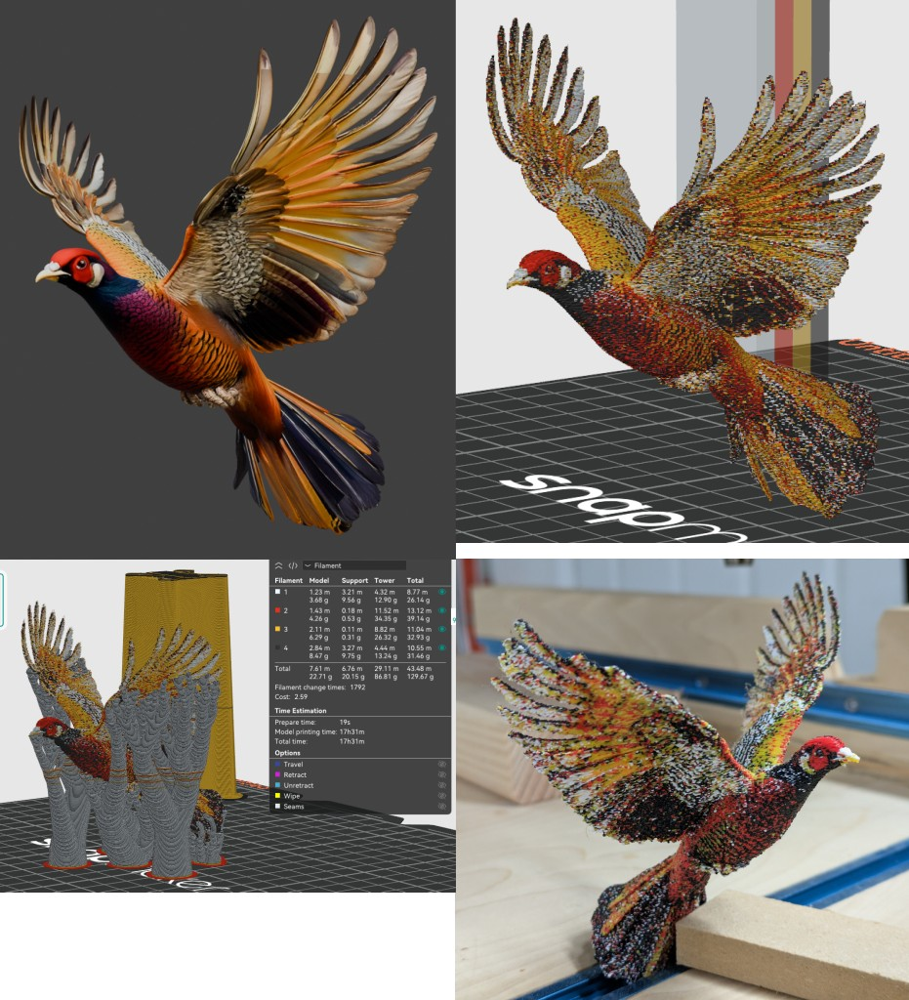

# ditherforge



Convert textured 3D models (GLB or 3MF) into multi-color 3D-printable files
(3MF) for multi-filament printers.

## Quick Start

```
go install github.com/rtwfroody/ditherforge@latest
ditherforge model.glb --size 100
```

This loads `model.glb`, scales it to 100mm, automatically picks the best 4
filament colors, and writes `output.3mf`. Open the result in OrcaSlicer or
BambuStudio and print.

The `--layer-height` option (default 0.2mm) should match the layer height you
use in your slicer. It controls the vertical resolution of the voxel grid, so
matching it to your print settings produces the best results.

## How It Works

1. **Load** a textured GLB or 3MF model and scale to millimeters.
2. **Voxelize** onto a square grid matching the printer's nozzle diameter and
   layer height, sampling colors from the original texture.
3. **Decimate** the input mesh to reduce triangle count before clipping.
4. **Dither** to approximate the full-color texture with the available filament
   palette.
5. **Clip** the mesh along voxel color boundaries, assigning each fragment a
   palette color.
6. **Export** a 3MF file with per-face material assignments.

## Color Palette Selection

ditherforge offers several ways to choose which filament colors to use:

**Default (no flags):** Automatically picks the best 4 colors from
cyan, magenta, yellow, black, white, red, green, and blue based on the
model's texture.

**Manual palette (`--palette`):** Specify exact colors by CSS name or hex code:
```
ditherforge model.glb --palette "red,white,blue,black"
```

**Auto-palette (`--auto-palette N`):** Compute N dominant colors directly from
the texture:
```
ditherforge model.glb --auto-palette 4
```

**Inventory file (`--inventory-file` + `--inventory N`):** Provide a file
listing your available filaments (one color per line), and let ditherforge pick
the best N. This is ideal when you have a specific set of spools on hand. See
[panchroma_basic.txt](panchroma_basic.txt) for an example inventory file.
```
ditherforge model.glb --inventory-file panchroma_basic.txt --inventory 4
```

## Dithering Modes

The `--dither` flag controls how colors are distributed across faces:

- **`dizzy`** (default) — Random traversal order with error diffusion to
  spatial neighbors. Produces blue-noise-like patterns without directional bias.
- **`none`** — Each face gets the nearest palette color with no dithering.

## Installation

Requires Go 1.21+.

```
go install github.com/rtwfroody/ditherforge@latest
```

Or build from source:

```
git clone https://github.com/rtwfroody/ditherforge.git
cd ditherforge
go build .
```

## Options

| Flag | Default | Description |
|------|---------|-------------|
| `--size` | — | Scale model so largest extent equals this value in mm |
| `--palette` | auto | Comma-separated colors (CSS names or `#hex`) |
| `--auto-palette N` | — | Compute N dominant colors from texture |
| `--inventory-file` | — | File with one filament color per line |
| `--inventory N` | — | Pick best N colors from inventory file |
| `--dither` | `dizzy` | Dithering mode: `none`, `dizzy` |
| `--nozzle-diameter` | `0.4` | Nozzle diameter in mm |
| `--layer-height` | `0.2` | Layer height in mm |
| `--scale` | `1.0` | Additional scale multiplier |
| `--output` | `output.3mf` | Output 3MF file path |
| `--no-merge` | — | Skip coplanar triangle merging |
| `--no-simplify` | — | Skip QEM mesh decimation before clipping |
| `--color-snap` | `5` | Shift cell colors toward nearest palette color by this many delta E units (0 to disable) |
| `--no-cache` | — | Disable voxelization cache |
| `--stats` | — | Print face counts per material |
| `--force` | — | Bypass the 300mm extent size check |

## Recommended Models

These models work well with ditherforge and are free to download:

| Model | Author | Source | License |
|-------|--------|--------|---------|
| Golden Pheasant | iRahulRajput | [Sketchfab](https://sketchfab.com/3d-models/golden-pheasant-f9b3decb485c4a7c9d97cf70b17cbd29) | [CC BY 4.0](http://creativecommons.org/licenses/by/4.0/) |

## Testing

```
go test -timeout 10m ./...
```

Regression tests render the output mesh from multiple views and compare
silhouettes and depth against the original model.

## Known Issues

- Sometimes generates features too thin for the slicer to print.

## Status

Early development. The output 3MF includes embedded printer profiles for the
Snapmaker U1 with a 0.4mm nozzle. Other printers may need manual profile
adjustment in the slicer.
