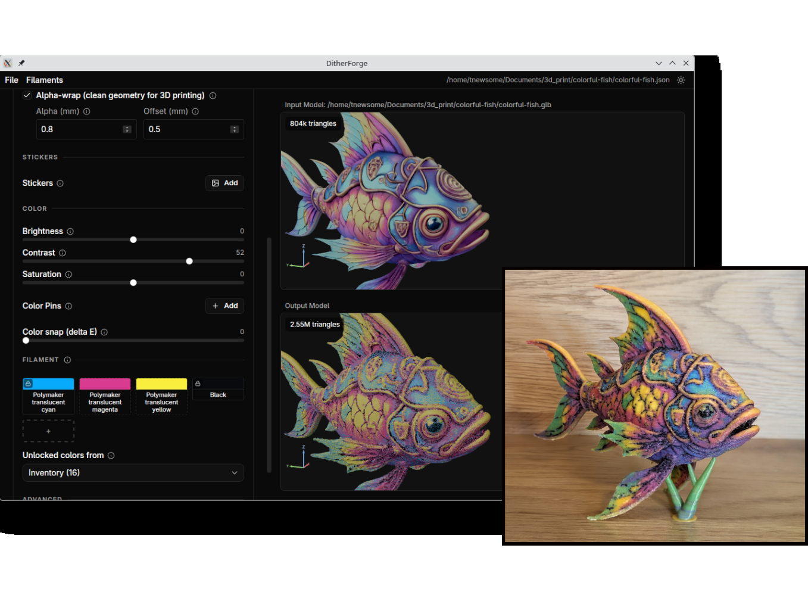

# DitherForge



Convert textured 3D models (GLB, 3MF, STL, OBJ, or COLLADA) into multi-color 3D-printable files
(3MF) for multi-filament printers.

## Download

Pre-built binaries for Linux, Windows, and macOS are available on the
[Releases](https://github.com/rtwfroody/ditherforge/releases) page.

## Quick Start

1. Launch `ditherforge`
2. In the **Model** section, click the **File** dropdown and choose **Browse
   for file…** to select a `.glb`, `.3mf`, `.stl`, `.obj`, or `.dae` (COLLADA)
   file (an OBJ or COLLADA model packaged in a `.zip` alongside its
   `.mtl`/textures also works). Previously loaded models are one click away
   under the dropdown's **Recent** submenu.
3. Open the **Print setup** section and set **Printer**, **Nozzle**, and
   **Layer** to match your slicer
4. Set **Size (mm)** in the **Model** section to your target print size
5. Optionally, open **Modify > Stickers** to apply PNG or JPEG images onto the model surface
6. Optionally, open **Modify > Split** to cut the model in two halves that print side-by-side and assemble with pegs
7. Adjust the palette and color settings — the output preview updates automatically
8. Use **File > Export 3MF** to save the result (defaults to `<input>.3mf`)
9. Open the exported 3MF in OrcaSlicer or BambuStudio and print

The sidebar has four sections — **Model**, **Appearance**, **Modify**, and
**Print setup** — plus a collapsed **Fine tuning** sub-section inside **Model**
and inside **Appearance** for the rarely-used knobs. All sections are
collapsible; click a section header to fold or expand it.

The input model is just another setting: swapping it from the **Model** dropdown
keeps the rest of your configuration — palette, adjustments, stickers, and color
pins all carry over (sticker placements rescale to the new model's size). The
**File** menu is JSON-only: **Open JSON…** and **Open Recent JSON** load and
list saved settings files.

For real use, you'll want to update your Inventory filament collection as
described right below.

---

## How to Manage Filament Collections

The **Filaments** menu lists all available filament collections. Click a
collection name to open its editor.

In the collection editor you can:

- Add, edit, or remove colors (click a swatch to change its hex, label, or
  **TD (mm)**)
- Delete the collection

**TD** is the filament's transmission distance in millimeters: how far light
travels through it before being absorbed. Higher TD means more translucent.
DitherForge uses it to pick better palettes, to weight the dither, and to
preview what the print will actually look like — see
[How to Handle Translucent Filaments](#how-to-handle-translucent-filaments).
New colors default to TD 1.0 (treated as opaque).

Use **Filaments > Import...** to load a collection from a plain-text file.
Each line is a color, an optional TD, and an optional label:

```
#FF0000 1.9 Red
#00FF00 0.4 Green
#0000FF Blue
```

The number after the color is the TD, following the Panchroma/HueForge
convention. Omit it (as on the `Blue` line) and the color is treated as
opaque. `td=1.9` anywhere on the line works too. Lines beginning with `# `
are comments.

Use **Filaments > New...** to create an empty collection and add colors
manually.

A built-in **Panchroma Basic** collection (28 colors, each with its
manufacturer TD) is included and cannot be deleted.

## How to Set Print Dimensions

Use **Size (mm)** to scale the model so its largest extent matches the given
value. For example, set `100` to make the model 100 mm wide (or tall, whichever
is larger).

Use **Scale** mode for a relative multiplier instead. Toggle between Size and
Scale using the radio buttons above the input field.

## How to Set Up Your Printer

The **Print setup** section holds **Printer**, **Nozzle**, and **Layer**. Set
them to match the machine and profile you will slice with — **Layer** in
particular must equal the layer height you slice at, or the slicer's layers
will not land on DitherForge's color bands.

**Nozzle** and **Layer** determine the voxel grid resolution. The base cell
width comes from the selected printer profile's extrusion line width (the
initial-layer line width for layer 0, the normal line width above it), falling
back to the bare nozzle diameter when no profile matches. Cell height comes
from the profile's initial-layer print height for layer 0 and from **Layer**
above it.

Two sliders scale the cell width on top of that base:

- **First-layer blob size** (1–15, default 2) — multiplies the layer-0 cell
  width. Higher values print the first layer as bigger color blobs that stick
  to the bed, at the cost of first-layer color resolution.
- **Color grid coarseness** (1–4, default 1.25) — multiplies the cell width on
  every layer above the first. Lower packs in finer color detail; below about
  1.20 the slicer starts dropping detail on vertical walls, so those cells
  often never reach the print.

The defaults are the Snapmaker U1 with a 0.4 mm nozzle and 0.20 mm layers.

## How to Select an Object in a Multi-Object File

3MF, GLB, and COLLADA files can contain multiple objects. When a file has more
than one, a **Select Object** dialog appears as soon as the model loads,
showing a thumbnail and triangle count per object. Choose **All Objects** to
process the entire file together, or pick a specific object to work with it
alone. STL files always contain a single mesh and the dialog does not appear.

## How to Set a Base Color for Untextured Faces

Meshes sometimes have faces without a texture or vertex color (common in STL
files and in some 3MF files). By default these faces render as plain white.
**Base color** in the **Model** section offers two modes:

- **Solid** — pick a single color from any of your filament collections.
  This acts as the "paint" applied to any face that has no other color
  assigned, before dithering and palette selection.
- **Texture** — load a [MaterialX](https://materialx.org/) shader graph
  (`.mtlx` file, or a `.zip` archive containing the `.mtlx` and its
  textures) and apply it as a procedural or image-backed pattern. Procedural
  graphs (marble, brick, conditional banding such as rainbow stripes) are
  sampled per voxel in 3D, so the pattern looks carved-from-the-block rather
  than projected. Image-backed PBR packs
  (Quixel, AmbientCG, …) are projected via triplanar mapping, so they wrap
  cleanly across faces without requiring authored UVs on the mesh.

  Two knobs appear once a file is loaded:

  - **Tile size** (mm) — the object-space distance one shading-unit cycle
    of the procedural maps to. For image packs this is also the texture's
    repeat distance. Smaller = denser pattern.
  - **Projection sharpness** — sharpness of the triplanar projection blend
    for image-backed graphs (0.5–32, default 4). `1` is a soft cosine blend;
    higher values approach a hard box map. Ignored by purely procedural
    graphs that don't read texture coordinates.

  Try the official [`standard_surface_marble_solid.mtlx`](https://github.com/AcademySoftwareFoundation/MaterialX/blob/main/resources/Materials/Examples/StandardSurface/standard_surface_marble_solid.mtlx)
  for a procedural example, or grab a free image-backed pack from
  [GPUOpen MatLib](https://matlib.gpuopen.com/main/materials/all) or
  [AmbientCG](https://ambientcg.com/) and feed in its `.zip` directly.
  Only the graph's `base_color` output is consumed — normal maps,
  roughness, etc. are ignored, and only RGB is baked into the print.

## How to Configure the Color Palette

The **Appearance** section lists one row per color slot. Each slot is either:

- **Locked** — a specific filament you have chosen
- **Auto** — filled automatically from the active filament collection

Click a row's swatch to open the collection picker and choose a filament color.
This locks the slot to that color. Use the **Locked** / **Auto** button at the
right of the row to toggle a slot between the two states; the button locks an
auto slot to whatever color was resolved for it.

Add slots with **+ Add color** (up to 16). Remove a slot with the **×** button
at the end of its row. The number of slots is the total number of filaments
used in the output.

Each row also shows what the last run did with that color: a **TD** badge with
the filament's transmission distance, a usage bar and percentage of output
triangles, and a **!** badge on any locked color the run never used. A summary
line below the list suggests removing unused locked colors.

### Auto colors

Auto slots are filled with the best-matching colors from the filament
collection selected under **Unlocked colors from**. Locked colors are taken
into account, so auto-selected colors complement rather than duplicate them.
Selection also accounts for each filament's translucency, so a palette isn't
chosen around a color the print cannot actually deliver — see
[How to Handle Translucent Filaments](#how-to-handle-translucent-filaments).

Use **Filaments** in the menu bar to manage collections. See [Managing Filament
Collections](#how-to-manage-filament-collections).

### Infill filament

The slicer prints all infill, solid infill, and inner walls with a single
filament. **Infill filament** chooses which palette entry that is. Because it
sits directly behind every translucent surface color, it shows through and
tints the whole model.

**Auto (most opaque)** is the default and picks the least translucent filament
in the palette. Pick a specific color to force it instead.

## How to Adjust Colors

Three sliders in the **Appearance** section adjust the model's colors before
palette selection:

- **Brightness** — lighten or darken (-100 to +100, default 0)
- **Contrast** — increase or reduce contrast (-100 to +100, default 0)
- **Saturation** — increase or reduce color intensity (-100 to +100, default 0)

The input preview reflects these adjustments instantly via GPU shaders. The
output re-renders with each change.

## How to Use Stickers

Stickers let you apply PNG or JPEG images directly onto the model surface
before voxelization. As you drag the cursor over the model while placing, a
floating billboard preview shows exactly where the sticker will sit.

To place a sticker:

1. Open **Modify > Stickers** in the sidebar.
2. Click **Add** and choose a PNG or JPEG file. A thumbnail appears in the
   panel and the app enters placement mode automatically.
3. Click a point on the input model. The sticker centers on that point,
   oriented to the surface. The input preview updates immediately to show the
   applied sticker.
4. Adjust **Scale**, **Rotation**, and **Mode** as needed.

### Sticker modes

Each sticker has two modes, selected with radio buttons:

- **Projection** (default) — projects the sticker along its normal, like a
  slide projector. The image lands on whatever front-facing surface is closest
  along the projection direction and does not wrap around corners. Works well
  on most shapes, including complex or non-developable geometry.
- **Unfold** — flood-fills from the clicked triangle across the mesh,
  unfolding each triangle into the sticker's tangent plane. The sticker wraps
  around curves following the surface. A **Surface bend limit** slider stops
  the flood-fill at sharp edges (0° = no limit). Best on developable patches
  (cylinders, cones, gentle curves).

There is no hard limit on the number of stickers. They are composited over the
base model color during voxelization and are affected by the brightness,
contrast, and saturation sliders like any other color on the model.

Sticker placements, scale, rotation, mode, and bend limit are saved and
restored with the JSON settings file.

## How to Use Color Pins

Color pins remap specific colors in the model before dithering. Use them to
correct individual colors without affecting the rest of the model — for example,
to shift a too-yellow green toward a truer green filament.

Each pin has:

- **Source color** — the color to replace, sampled from the input model or
  typed as `#RRGGBB`
- **Target color** — the filament color to map toward, chosen from a collection
- **Reach** — how far the adjustment spreads in color space (delta E units,
  default 5). Higher values affect a broader range of similar colors.

To sample a source color from the model, click the eyedropper icon on a pin
and then click a point on the input model preview. The color at that pixel is
captured as the source.

Up to 8 pins are supported. The pipeline uses Gaussian RBF interpolation in
CIELAB color space to blend multiple pin effects smoothly.

## How to Reduce Speckle in Near-Solid Areas

**Color similarity threshold** (in the **Appearance** section) shifts each
voxel's color toward the nearest palette color before dithering, by up to the
given CIELAB delta E distance. This reduces noise in regions that are nearly a
single solid color.

The range is 0 to 50, default 5. Higher means fewer speckles and less color
detail. Set to 0 to disable.

## How to Repair a Broken Mesh

Many downloaded models have holes, self-intersections, thin walls, or inverted
normals that break the boolean operations DitherForge (and slicers) rely on.
The **Repair geometry** selector in the **Model** section rebuilds a
watertight mesh before processing:

- **None** (default) — the model is used as-is. Fine for clean, watertight
  meshes.
- **Winding-number remesh** — samples the mesh's fast winding number on a
  grid and rebuilds the surface from it. Medium speed; fixes most broken
  meshes, though detail finer than the grid is resampled away. Two knobs
  control the grid pitch: **Detail XY (mm)** (auto = nozzle diameter) and
  **Detail Z (mm)** (auto = layer height) — matching the printer's real
  resolution in each axis, so vertical fidelity comes cheap.
- **Alpha wrap** — shrink-wraps a watertight shell around the input (CGAL
  Alpha-wrap). Slow but most robust; bridges small gaps and pockets. Two
  knobs: **Detail size (mm)** (the probe radius; auto = nozzle diameter) and
  **Surface offset (mm)** (how far the shell sits above the surface; auto =
  detail / 30).

Repair runs inside the Load stage and its result is cached, so switching
downstream settings doesn't repeat it.

## How to Keep Color Edges Crisp

Two options in **Appearance > Fine tuning** keep sharp color boundaries from
muddying. They are independent and can be used together.

- **Color-aware cells** (on by default) — segments each layer by color and
  tiles each monochrome region separately, so cell boundaries land *on* color
  boundaries. A checkerboard or other sharp pattern stays pure black/white
  instead of averaging to gray along the edges. Color features smaller than one
  cell are merged into a neighbouring region; the merge keeps the
  highest-contrast color boundary crisp — a thin strip between black and white
  cedes to whichever side it least resembles rather than smearing the sharp edge
  toward gray. The **Edge sharpness threshold** slider sets how
  different two surface colors must be before their boundary is cut into a cell
  edge — low (~5) cuts almost any edge, higher (~20–30) only crisp ones.
- **Confine dither to color regions** (off by default) — stops dither error
  from bleeding across color boundaries. The cell graph is split into color
  regions and each is dithered in isolation, so a gray area's error can't
  speckle an adjacent solid black or white area. Smooth gradients still diffuse
  normally; only sharp color jumps act as barriers. Works with every dither
  mode. The **Region barrier threshold** slider sets how different neighboring
  colors must be to count as a barrier.

A third option in the same sub-section cleans up cells that straddle a
boundary:

- **Reject color outliers** (on by default) — when one color holds at least
  75% of a cell's samples, the stray one or two samples that leaked in across
  a color boundary are dropped instead of dragging the cell's averaged color.
  Genuinely mixed cells keep every sample, so dithering is unaffected.

## How to Choose a Dither Mode

**Mode** in the **Appearance** section selects how each voxel's pre-dither
color is mapped onto a palette color. Each choice is a button carrying a live
preview thumbnail rendered with your current palette. Different modes trade
global accuracy ("drift": does the average output color match the average
input?) against local pattern ("wander": how far from the nearest-input
palette do picks reach?).

The choices are:

- **Dizzy damped** (default) — randomized error-diffusion (Liam Appelbe's
  blue-noise dizzy) iterated with a *localized*, damped drift correction:
  each pass spreads the residuals that stranded cells would otherwise drop
  onto their own neighbors, so the fix stays where the error arose. Matches
  Dizzy's blue-noise texture while keeping each color region's average true.
  Won the 2026-07 CSF perceptual election, which is why it is the default.
- **Floyd-Steinberg** — deterministic scanline order. Preserves average
  chroma exactly, but produces visible directional structure on flat areas.
- **Riemersma** — walks voxels along a locally-coherent tour and
  diffuses each cell's quantization error into a sliding window of recent
  cells. Preserves average color exactly (zero drift) and avoids the
  scanline directionality of Floyd-Steinberg.
- **Blue noise** — picks the smallest palette simplex (pair, triangle, or
  full) that brackets each cell's input within a fixed tolerance, then
  chooses among its vertices via a low-discrepancy sequence. Bounds wander
  tightly on uniform regions at the cost of a small global drift.
- **None** — no dithering; each cell snaps to the nearest palette color.

When **Riemersma** is selected, an **Alpha** slider
appears (0..1, default 0.85). It's the per-cell input-bias maximum: pulls
each cell's pick toward its nearest-input palette when the cell is close to
a palette color. 0 = pure error-diffusion (zero drift but black/white
oscillation around near-grey input). Higher values suppress that
oscillation; ≥0.9 starts to posterize textured surfaces.

## How to Handle Translucent Filaments

Most filaments are not opaque. Light entering a translucent surface color
passes through it, bounces off whatever is behind — neighboring dither cells,
then the infill — and comes back out carrying that color. A translucent yellow
printed over black infill reads as a dull olive, not yellow. DitherForge
accounts for this end to end, driven by each filament's **TD** (transmission
distance) from its collection entry.

Four things follow from TD:

- **Palette selection.** Auto slots are chosen against the color each filament
  can actually deliver in a print, not its nominal swatch color, so the
  selector won't build a palette around a color that washes out.
- **Infill filament.** Palette entry 0 is the filament the slicer uses for
  infill and inner walls, and it backs every translucent surface color. See
  [Infill filament](#infill-filament).
- **Dithering.** Each cell is scored against its predicted printed appearance,
  including the colors its already-assigned neighbors contribute.
- **Preview.** The output viewer can show the predicted printed colors instead
  of the nominal filament colors.

### Translucency-aware mixing

**Translucency-aware mixing** in **Appearance > Fine tuning** is on by default.
It opacity-weights the dither by TD, so a translucent filament is given more
area to deliver the same perceived color and isn't lost under opaque
neighbors. Untick it to treat every filament as opaque.

With it on, a **Translucency model** selector appears:

- **Area compensation** (default) — the opacity-weighted mix described above.
- **Layered (infill-aware)** — estimates the color the eye actually sees once
  light leaks through the finite shell into the infill filament, and dithers
  against those effective colors. The shell thickness it integrates over is
  derived from the selected printer's wall settings (wall loops × line widths)
  — the same process profile written into the exported 3MF.

### Simulate print translucency

The output viewer's view menu (top right of the Output pane) has a
**Simulation** group with a **Simulate print translucency** checkbox, on by
default. With it ticked, each face is drawn in the color that cell is predicted
to print as, blended with its neighbors, rather than in the nominal filament
color. Untick it to see the raw palette assignment.

The checkbox is greyed out when every filament in the palette is opaque, since
there is then nothing to simulate. It is a view setting only — it changes
nothing in the exported file and is not saved to the settings JSON.

## How to Calibrate Filament Colors with Swatch Plates

Published TD values and hex codes are approximations. **Debug > Export Swatch
Plates…** generates a printable 3MF of calibration plates so you can measure
how your actual filaments mix on your actual printer.

1. Run the pipeline once so the palette is resolved. The menu item is disabled
   until then.
2. Choose **Debug > Export Swatch Plates…** and pick a save path. The dialog
   defaults to the directory of the current settings file and to a filename
   built from the layer height and the palette's color labels, for example
   `swatches-0.2mm-Black-Brown-Tan-White.3mf`.
3. Print the file with the same printer, nozzle, and layer height the settings
   use, and with the palette's filaments loaded in export order.

The export contains one plate per unordered pair of palette filaments, so an
n-color palette produces n×(n−1)/2 plates. Each plate is a 90 × 10 × 2 mm slab
that prints standing on edge, spaced 12 mm apart on the build plate. Its face is a
row of nine 10 × 10 mm sections mixing the two filaments at coverages of 0,
1/8, … 8/8 from left to right. The mixture is a void-and-cluster blue-noise
speckle on the pipeline's own cell grid — one voxel cell wide, one print layer
tall — so it dithers the way real output does and the coverage of each section
is exact and known. Plate edges are chamfered for print quality.

Alongside the 3MF, DitherForge writes a `<name>.3mf.swatch.json` manifest
recording the printer, nozzle, layer height, block grid, the blue-noise
ranking, the palette with TDs, the designated infill filament, and the nominal
versus realized coverage of every section. Photographing the printed plates and
comparing against the manifest gives you the real physical mixing curve between
each pair.

`tools/swatchphoto/` in the source tree is a Python script that does exactly
that: point it at a photo of the printed plates and the manifest, and it
recovers the measured filament colors and the bleed between them. It ships with
the source rather than the binaries — see its own README for usage.

Swatch generation runs on its own pipeline instance with its own cache, so it
leaves your model, viewer, and stage caches untouched.

## How to Split a Model into Two Halves

The **Split** panel cuts the model along an axis-aligned plane into two halves
that print separately and assemble back into the original. Both halves are
laid out side by side on the build plate, sitting flat on the cut face. Use
this when the model is taller than your build volume, when supports for an
overhang would otherwise be hard to remove, or when you want to paint each
half before assembly.

To split a model:

1. Open **Modify > Split** and check **Split into two parts**. A mesh-repair
   mode is enabled automatically (Alpha wrap, unless a repair mode is already
   selected) — a clean cut needs a watertight input mesh.
2. Choose the **Cut plane** (XY, XZ, or YZ) and the **Offset** along that
   axis. The 3D viewer overlays a translucent quad showing the live cut
   position.
3. Optionally tilt the cut off-axis with the two **Tilt about …** angles
   (±85° each). Both at 0° gives a flat axis-aligned cut; combine the two
   for a fully oblique plane.
4. Pick a **Connector style**:
   - **Pegs** — a solid peg on one half mates with a matching pocket on the
     other. Best for FDM where dowel hardware isn't on hand. Two peg
     options choose which half carries the male pegs.
   - **Dowel/magnet holes** — matching pockets on both halves; print
     or buy dowel pins, or glue in magnets for a magnetic catch.
   - **None** — flat cut, glue-only assembly.
5. Adjust **Count** (number of connectors along the cut; **Auto** picks 1, 2,
   or 3 based on the cut polygon's inscribed-circle radius), **Diameter**,
   **Depth**, and **Clearance** (per-side radial gap on the female feature so
   the peg slides in) as needed. The gap between the two halves on the plate
   is fixed at 5 mm.
6. Choose how each half rests on the bed with the per-half orientation
   dropdowns. **Cut face down/up** rests the half on its seam (the default,
   and it stays flat even when the cut is tilted); the **±axis up** options
   rest the half on a model side instead.
7. Export the result with **File > Export 3MF** as usual. The exported file
   contains two build items, one per half, that the slicer treats as
   independent objects.

The freshly exposed cut face is hidden once the halves are reassembled, so
DitherForge fills it (and any connector pockets) with a single flat filament —
the nearest palette color to the cut's average — instead of wasting print time
dithering a surface no one sees. Only a thin rim at the visible perimeter seam
keeps its dithered detail. This is automatic; there is no toggle.

Stickers, color pins, and base color are applied to the original (unsplit)
mesh, so they survive the cut and appear on whichever half they land on.
Split panel state is saved and restored with the JSON settings file.

If you set **Repair geometry** back to **None** while Split is enabled, Split
is automatically disabled as well. A toast explains the dependency.

## How to Save and Load Settings

Use **File > New** to reset every setting to its factory default — palette,
color pins, adjustments, dither mode, split, the lot. Useful when starting
fresh on a new model without manually undoing the previous session's
configuration. Anything missing from a settings file you load is treated
the same way: it falls back to its factory default rather than carrying over
from the previously loaded settings.

Use **File > Save JSON** to save all current settings — palette, color pins,
adjustments, size, and nozzle settings — to a JSON file.

Use **File > Save JSON As...** to save to a new file.

Use **File > Open JSON…** and select a `.json` file to restore all settings and
re-open the associated model. Recently loaded settings files are listed under
**File > Open Recent JSON**. (To swap only the model without touching other
settings, use the **File** dropdown in the **Model** section instead.)

Settings files are automatically associated with the input model. When you open
a model, DitherForge suggests a default settings path based on the model's
filename.

## How to Export a 3MF

Use **File > Export 3MF...** after the pipeline finishes (the output preview
is visible). The exported file includes per-face material assignments
compatible with OrcaSlicer and BambuStudio.

**File > Export 3MF** is disabled until the pipeline produces a valid output.

---

## How It Works

1. **Load** — reads a GLB, 3MF, STL, OBJ, or COLLADA file and scales it to millimeters. The
   model bottom is normalized to Z = 0. For files with multiple objects, the
   selected object (or all objects) is processed. The geometry mesh is then
   decimated to voxel resolution with QEM mesh decimation — detail finer than
   the voxel grid won't survive voxelization, so discarding it here keeps the
   downstream stages fast. The pristine mesh is kept separately for color
   sampling, so textures and per-face colors stay at full resolution.
2. **Stickers** — maps each sticker image onto the mesh. "Projection" mode
   (the default) projects the image along the sticker normal onto the
   frontmost surface; "Unfold" mode flood-fills from the placement point
   across mesh adjacency. Sticker colors are alpha-composited over the base
   texture.
3. **Split** (optional) — cuts the geometry mesh along the configured plane
   (axis-aligned or tilted) using CGAL's `Polygon_mesh_processing::clip`,
   bakes peg or dowel connectors into the cut faces via boolean ops, and lays
   the two halves side by side on the build plate. The hidden cut face is
   flat-filled with a single filament (only the visible perimeter rim keeps
   its dither). Color sampling stays in the original mesh's coordinate frame,
   so stickers, color pins, and base color survive the cut unchanged.
4. **Voxelize** — maps the model onto a grid of cells matching the printer,
   nozzle, and layer settings. Each cell gets the color sampled from the
   original texture (including any stickers). Cell width comes from the
   printer profile's extrusion line width scaled by **First-layer blob size**
   on layer 0 and by **Color grid coarseness** above it.
5. **Color adjust** — applies brightness, contrast, and saturation.
6. **Color warp** — applies color pin remappings using Gaussian RBF
   interpolation in CIELAB color space.
7. **Palette** — resolves locked colors, then selects auto colors from the
   active collection, scoring candidates against the color each filament can
   actually deliver once its translucency and the infill behind it are taken
   into account. The infill filament is designated (explicitly, or the most
   opaque entry) and moved to palette index 0, which is what the slicer prints
   infill and inner walls with. Applies the color similarity threshold to
   shift cell colors toward the palette.
8. **Dither** — assigns a palette color to each cell to approximate the original
   texture, scoring each candidate by its predicted printed appearance given
   the cell's already-assigned neighbors. The default `dlc-d30-p7` mode
   ("Dizzy damped") is randomized
   error-diffusion iterated with a localized, damped drift correction, keeping
   each color region's average true with no directional structure. Four other
   modes are available — `floyd-steinberg`, `riemersma`, `bn-adapt-5`, and
   `none` — each with different drift/wander/structure trade-offs. See
   [How to Choose a Dither Mode](#how-to-choose-a-dither-mode).
9. **Clip** — cuts the decimated mesh along voxel color boundaries and assigns
   each fragment a palette color.
10. **Merge** — merges coplanar triangles to reduce face count.
11. **Export** — writes a 3MF file with per-face material assignments. When
    Split is enabled, two `<object>` entries are emitted (one per half) so
    slicers see them as independent build items.

If **Repair geometry** is set (Model section), the repair runs inside the
Load stage to produce a watertight mesh — either a fast-winding-number remesh
sampled on a nozzle-by-layer-height grid, or a CGAL alpha-wrap shell (the
load-time decimation feeds the wrap a mesh already pruned to voxel
resolution). Split also forces a repair mode on, since the cut needs a
watertight input.

Each stage is cached by its settings hash. Changing a downstream parameter
(e.g., dithering mode) skips all upstream stages on the next run. The stage
caches persist across app restarts on disk (zstd-compressed), so re-opening a
recent model is much faster than the first time — in particular the Load cache,
which subsumes both decimation and mesh repair, the slowest upstream work.

While the pipeline runs, the output stage list shows live progress for each
stage along with cache hit/miss status; stages replayed from the disk cache
show a **(cache)** badge with their load time. If a stage fails, the error
message appears as a final line in the list.

The Output viewer doesn't wait for the pipeline to finish. When you change a
setting, the previous output stays visible under the progress overlay until
its replacement is ready (export stays disabled until the new result lands).
And as soon as dithering completes — before the slow Clip and Merge stages —
the viewer swaps in an instant approximate preview built from one small
colored quad per cell, so you see the dithered colors in seconds instead of
minutes; the exact clipped mesh replaces it when Clip and Merge finish.

---

## CLI

`ditherforge-cli` runs the same pipeline from the command line, without a GUI
window. It is driven by a **DitherForge settings `.json` file** — the same
format the GUI saves and loads. Every processing option (input model, size,
palette, inventory, dither mode, base color, stickers, color pins, splitting,
…) lives in that file, so the GUI and CLI always produce identical output from
the same settings.

```
ditherforge-cli settings.json
```

Set up the model and options in the GUI, save the settings file, then point the
CLI at it. The input model is taken from the settings file's `inputFile` field;
its path is resolved relative to the `.json`. The output is written next to the
current directory as `<model>.3mf` unless `--output` is given.

Inputs may be `.glb`, `.3mf`, `.stl`, `.obj`, or `.dae` (COLLADA) — plus an OBJ
or COLLADA model packaged in a `.zip` with its `.mtl`/textures.

### Options

The CLI has only the handful of flags that are *not* processing options (those
all come from the JSON):

| Flag | Default | Description |
|------|---------|-------------|
| `<settings.json>` | — | Required. DitherForge settings file holding the input path and all processing options. |
| `--output` | derived from the model name | Output `.3mf` file path |
| `--force` | — | Bypass the 300 mm extent size check |
| `--debug-render DIR` | — | Write PNG renders (input + dithered + sampled + print simulation, four views each) into `DIR` |
| `--debug-render-res` | `800` | Square PNG resolution for `--debug-render` |
| `--debug-cells-dir DIR` | — | After voxelization, write per-slab cell PNGs colored by sampled RGB into `DIR` |

The `printsim_<view>.png` renders written by `--debug-render` show the
predicted printed colors — the same thing the GUI's **Simulate print
translucency** toggle shows. They are skipped, with a note on stderr, when
every filament in the palette is opaque.

The inventory collection named in the settings file is resolved from the same
built-in and user collections the GUI uses (e.g. `Inventory`, `Panchroma
Basic`). User collections live in `~/.config/ditherforge/collections/`.

---

## Building from Source

Requires Go 1.24+, Node.js 20.19+ (or 22.12+), and the [Wails](https://wails.io/) CLI.

Install Wails:

```
go install github.com/wailsapp/wails/v2/cmd/wails@latest
```

Build both binaries:

```
git clone https://github.com/rtwfroody/ditherforge.git
cd ditherforge
./build.sh
```

This produces:
- `build/bin/ditherforge` — desktop GUI
- `ditherforge-cli` — CLI tool

For development with hot reload:

```
wails dev
```

## Testing

```
go test -timeout 10m ./...
```

---

## Recommended Models

These models work well with DitherForge and are free to download:

| Model | Author | Source | License | Notes |
|-------|--------|--------|---------|-------|
| Golden Pheasant | iRahulRajput | [Sketchfab](https://sketchfab.com/3d-models/golden-pheasant-f9b3decb485c4a7c9d97cf70b17cbd29) | [CC BY 4.0](http://creativecommons.org/licenses/by/4.0/) | |
| Colorful Fish | Kamilla Kraus | [Fab](https://www.fab.com/listings/e8431f81-ca7f-43bb-a28d-d5589037491c) | [CC BY 4.0](http://creativecommons.org/licenses/by/4.0/) | Pick a **Repair geometry** mode to clean up the model's mesh. |

---

## Known Issues

### Unfold-mode stickers on highly curved or closed shapes

On surfaces that curve sharply or wrap back on themselves (e.g. the
outside of a bowl, the rim of a cup) an unfold-mode sticker can come out
stretched horizontally or repeated several times across the model
instead of appearing once at the placement. This is why **projection**
is the default mode; switch to unfold only on developable patches like
cylinders or gentle curves where wrapping around the surface matters.

---

## Appendix: Feature Reference

### Print Settings

| Setting | Default | Description |
|---------|---------|-------------|
| Model file | none | The 3D model to convert, picked from the **File** dropdown at the top of the Model section (**Browse for file…** or **Recent**). Changing it swaps only the model — all other settings, stickers, and color pins are kept. |
| Printer | Snapmaker U1 | (Print setup.) Target printer profile. Restricts which nozzle and layer-height values are selectable, and determines which printer/process settings are embedded in the exported 3MF. |
| Size (mm) | 100 | Scale the model so its largest extent equals this value in mm |
| Scale | 1.0 | Relative scale multiplier |
| Nozzle | 0.4 mm | (Print setup.) Nozzle variant of the selected printer. Sets the base voxel cell width, via the profile's extrusion line widths. |
| Layer | 0.20 mm | (Print setup.) Layer height. Sets the voxel cell height and must match the layer height you slice with. |
| First-layer blob size | 2 | (Print setup.) Multiplier (1–15) on the layer-0 cell width. Higher = bigger first-layer blobs for bed adhesion, coarser first-layer color. |
| Color grid coarseness | 1.25 | (Print setup.) Multiplier (1–4) on the cell width above layer 0. Lower packs in finer color detail; below ~1.20 the slicer may drop it. |
| Object | All Objects | For multi-object files, a **Select Object** dialog appears on load to choose which object(s) to process |
| Base color | white | Color used for mesh faces that lack texture or vertex color |

### Color Adjustments

| Setting | Range | Default | Description |
|---------|-------|---------|-------------|
| Brightness | -100 to +100 | 0 | Shifts all colors lighter or darker before palette selection |
| Contrast | -100 to +100 | 0 | Increases or reduces the tonal range |
| Saturation | -100 to +100 | 0 | Increases or reduces color intensity |

### Stickers

Stickers composite PNG or JPEG images onto the model surface before voxelization.

| Field | Description |
|-------|-------------|
| Image | PNG or JPEG file to use as the sticker |
| Placement | Set by clicking a point on the input model. A floating billboard preview follows the cursor during placement. |
| Scale | Size of the sticker on the surface, in mm |
| Rotation | Rotation of the sticker around the surface normal (0–360°) |
| Mode | **Projection** (default) projects the image along the normal onto the nearest front-facing surface. **Unfold** flood-fills across mesh adjacency, wrapping around curves. |
| Surface bend limit | (Unfold mode only.) Stops flood-fill where adjacent faces exceed this angle. 0 = no limit. |

Multiple stickers can be added. They are applied in order and composited over
the base model color. Sticker colors are subject to the same brightness,
contrast, and saturation adjustments as the rest of the model.

Stickers are saved as part of the JSON settings file.

### Split

Cuts the model along an axis-aligned plane into two halves laid out side by
side on the build plate. Optional connectors register the halves during
glue-up.

| Field | Default | Description |
|-------|---------|-------------|
| Split into two parts | off | Master toggle. When off, the rest of the section is hidden and the pipeline behaves as if Split didn't exist. Forces a mesh-repair mode on (Alpha wrap, unless one is already selected); setting Repair geometry to None auto-disables Split. |
| Cut plane | XY | Axis-aligned plane: XY (cut along Z), XZ (cut along Y), or YZ (cut along X). |
| Offset (mm) | bbox mid | Position of the cut plane along the chosen axis, measured from the model's local origin. Adjustable via number field or slider. |
| Tilt about … (°) | 0 | Two angles (±85° each) that tilt the cut off the chosen axis. Both 0° = flat axis-aligned cut; combine for a fully oblique plane. |
| Connector style | Pegs | `Pegs` (built-in male/female; two options choose which half carries the pegs), `Dowel/magnet holes` (matching pockets for separate dowel pins or glued-in magnets), or `None` (flat cut). |
| Count | Auto | Number of connectors. `Auto` picks 1, 2, or 3 based on the cut polygon's inscribed-circle radius. |
| Diameter (mm) | 3.0 | Connector diameter. Hidden when style is None. |
| Depth (mm) | 2.0 | Connector depth (per side for dowels/magnets). Hidden when style is None. |
| Clearance (mm) | 0.15 | Per-side clearance applied to the female feature, both radially (pocket diameter) and axially (pocket depth). |
| Half orientation | Cut face down/up | Per half, how it rests on the bed. `Cut face down/up` rests on the seam (stays flat even when tilted); `±axis up` rests on a model side. |

While the Split panel is open, a translucent overlay in the 3D viewer shows
the live cut plane through the input model.

### Color Pins (Warp Pins)

Each pin maps a source color to a target filament color using Gaussian RBF
interpolation in CIELAB color space.

| Field | Description |
|-------|-------------|
| Source color | Color in the model to remap. Enter as `#RRGGBB` or use the eyedropper to sample from the input viewer. |
| Target color | Filament color to map toward. Selected from a filament collection. |
| Reach (sigma) | Gaussian falloff in delta E units (1–100, default 5). Controls how broadly similar colors are also shifted. |

Up to 8 pins. Invalid pins (missing source or target hex) are silently ignored.

### Palette

| Feature | Description |
|---------|-------------|
| Color slots | 1–16 slots, one row each. Each slot is locked (specific filament) or auto (selected from the collection). |
| Lock / unlock | The **Locked** / **Auto** button at the right of a row toggles it. Locking an auto slot pins whatever color was resolved for it. |
| Collection picker | Click a row's swatch to open the filament picker and lock that slot to a color. |
| Add / remove | **+ Add color** appends a slot (up to 16); **×** removes one. |
| Per-row status | **TD** badge (filament transmission distance), usage bar and percentage of the last run's output triangles, and a **!** badge on locked colors the run never used. |
| Unlocked colors from | The filament collection used to fill auto slots. |
| Infill filament | Which palette entry the slicer prints infill, solid infill, and inner walls with. `Auto (most opaque)` (default) picks the least translucent entry; otherwise pick a specific palette color. Becomes palette index 0. |

### Color Similarity Threshold

Shifts each voxel's color toward its nearest palette color by up to the
configured delta E distance before dithering. Reduces noise in nearly
solid-color regions.

| Setting | Range | Default | Description |
|---------|-------|---------|-------------|
| Color similarity threshold | 0–50 delta E | 5 | Pre-dither snap distance. Higher = fewer speckles, less color detail. Set to 0 to disable. |

### Filament Collections

| Feature | Description |
|---------|-------------|
| Built-in collection | "Panchroma Basic" — 28 colors with manufacturer TD values, read-only |
| Custom collections | Created via Filaments > New... or Filaments > Import... |
| Import format | Plain text, one color per line: `#RRGGBB [TD] [Label]`, e.g. `#FF0000 1.9 Red`. The TD is optional (omitted = opaque); `td=1.9` anywhere on the line also works. Lines starting with `# ` are comments. |
| Editing | Click a swatch in the collection editor to change its hex value, label, or **TD (mm)** |
| TD | Transmission distance in mm: how far light travels through the filament before being absorbed. Higher = more translucent. Defaults to 1.0 for colors with no TD. |

### Translucency (TD)

| Setting | Default | Description |
|---------|---------|-------------|
| Translucency-aware mixing | on | (Appearance > Fine tuning.) Opacity-weight the dither by each filament's TD, so translucent filaments get more area and aren't lost under opaque ones. Untick to treat every filament as opaque. |
| Translucency model | Area compensation | (Appearance > Fine tuning; shown only when translucency-aware mixing is on.) `Area compensation` is the opacity-weighted mix. `Layered (infill-aware)` estimates the color seen once light leaks through the shell into the infill filament and dithers against those effective colors, using the shell thickness derived from the selected printer's wall settings. |
| Simulate print translucency | on | (Output viewer view menu, **Simulation** group.) Draw each face in its predicted printed color — blended with its neighbors and the infill behind it — instead of the nominal filament color. Disabled when every filament is opaque. A view setting only: it changes nothing in the output and is not saved to the settings file. |

### Swatch Calibration Plates

**Debug > Export Swatch Plates…** writes a printable 3MF of filament
calibration plates for the current palette, plus a `<name>.3mf.swatch.json`
manifest. Requires a completed run. See
[How to Calibrate Filament Colors with Swatch Plates](#how-to-calibrate-filament-colors-with-swatch-plates).

| Property | Value |
|----------|-------|
| Plates | One per unordered pair of palette filaments (n×(n−1)/2 for n colors) |
| Plate size | 90 × 10 × 2 mm, printed standing on edge, 12 mm center-to-center |
| Sections | 9 per plate, 10 × 10 mm, at coverages 0, 1/8, … 8/8 left to right |
| Pattern | Void-and-cluster blue noise on the pipeline cell grid: one voxel cell wide, one print layer tall |
| Default filename | `swatches-<layer height>mm-<palette labels, alphabetical>.3mf`, saved next to the current settings file |
| Manifest | Printer, nozzle, layer height, block grid, blue-noise ranking, palette with TDs, infill filament, and nominal vs. realized coverage per section |

### Settings Files (JSON)

| Operation | Menu item | Behavior |
|-----------|-----------|---------|
| Save | File > Save JSON | Saves to current path; prompts for path if unsaved |
| Save to new file | File > Save JSON As... | Always prompts for a file path |
| Load | File > Open JSON… | Opening a `.json` file restores all settings and re-opens the model |
| Recent | File > Open Recent JSON | Lists recently loaded settings files |

Saved settings include: input file path, size/scale, printer, nozzle, layer
height, palette (locked colors, collection, and infill filament), color
adjustments, color pins, stickers, dither mode, color similarity threshold,
translucency options, split configuration, and fine-tuning flags.

### Fine Tuning

Rarely-used options, in a collapsed **Fine tuning** sub-section inside the
**Model** and **Appearance** sections.

| Option | Section | Default | Description |
|--------|---------|---------|-------------|
| No coplanar merge | Model | off | Skips merging coplanar same-color triangles after clipping. More triangles, but the raw clipped geometry. |
| No simplify | Model | off | Disables the load-time QEM mesh decimation. Accurate but dramatically larger. |
| No cell merge | Model | off | Clips every cell individually instead of pairing adjacent same-color cells within a layer. Slower and produces more triangles; does not change colors. |
| Color-aware cells | Appearance | on | Tiles each layer per color region so cell boundaries land on color boundaries (crisp edges). See [How to Keep Color Edges Crisp](#how-to-keep-color-edges-crisp). |
| Edge sharpness threshold | Appearance | 20 | (Color-aware cells.) Minimum CIELAB color difference (0–50) for a boundary to be cut into a cell edge. |
| Confine dither to color regions | Appearance | off | Dithers each color region in isolation so error can't bleed across sharp color boundaries. See [How to Keep Color Edges Crisp](#how-to-keep-color-edges-crisp). |
| Region barrier threshold | Appearance | 20 | (Confine dither.) Minimum CIELAB color difference (0–50) for a cell boundary to act as a dither-error barrier. |
| Reject color outliers | Appearance | on | Drops the stray one or two samples that leaked across a color boundary into a cell whose samples are ≥75% one color. Mixed cells keep every sample. |
| Translucency-aware mixing | Appearance | on | See [Translucency (TD)](#translucency-td). |
| Translucency model | Appearance | Area compensation | See [Translucency (TD)](#translucency-td). |

### Mesh Repair (GUI)

**Repair geometry** and its knobs live in the **Model** section.

| Option | Default | Description |
|--------|---------|-------------|
| Repair geometry | None | Rebuilds a watertight mesh before processing: `None` (model as-is), `Winding-number remesh` (medium speed, fixes most broken meshes), or `Alpha wrap` (slow but most robust). See [How to Repair a Broken Mesh](#how-to-repair-a-broken-mesh). |
| Detail XY (mm) | nozzle diameter | (Winding-number remesh.) Horizontal grid pitch. Smaller keeps more detail; larger is faster. |
| Detail Z (mm) | layer height | (Winding-number remesh.) Vertical grid pitch. Smaller keeps more detail; larger is faster. |
| Detail size (mm) | nozzle diameter | (Alpha wrap.) Probe radius. Larger = smoother wrap that bridges gaps but loses detail; smaller = hugs the surface more tightly. |
| Surface offset (mm) | detail / 30 | (Alpha wrap.) How far the wrap sits above the input surface. Larger values shrink-wrap less tightly. |

### Debug Menu

| Item | Description |
|------|-------------|
| View Cells… | Opens a pannable, zoomable per-slab view of the cell partition, each cell filled with its raw sampled RGB before dithering. Needs a completed run. |
| Select Triangle… | Click a triangle in either viewer for per-triangle diagnostics. |
| Select Cell… | Click an output cell for per-cell sampling-ray diagnostics. Needs a completed run. |
| Export Swatch Plates… | Writes printable filament calibration plates plus a manifest. Needs a completed run. See [Swatch Calibration Plates](#swatch-calibration-plates). |
| Stats | Logs face counts per material to the status bar. |
| Show sampled colors | Colors the output mesh by each face's raw sampled RGB instead of its dithered palette color, to isolate sampling problems from dither or palette problems. |

---

## Status

Ready for use. The output 3MF includes embedded printer/process profiles
for the Snapmaker U1, Snapmaker J1, Prusa XL (2 tools), Prusa XL (5 tools),
Bambu Lab H2D, Bambu Lab H2D Pro, Flashforge AD5X, Flashforge Creator 5,
Flashforge Creator 5 Pro, Flashforge Guider4, and Flashforge Guider4 Pro
across their supported nozzle and layer-height combinations. Only the
Snapmaker U1 path has been tested end-to-end on real hardware; the other
profiles are wired up but unverified, and may need manual adjustment in
the slicer.
