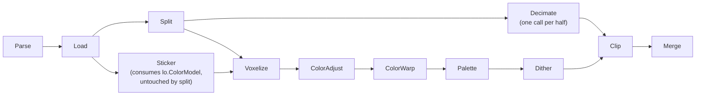

# Split feature — design doc

Status: design, not yet implemented.
Owner: tim
Last updated: 2026-04-29

## Goal

Let the user split a model into two halves that print separately and assemble
into the original. Both halves print on the same build plate, sitting flat on
the cut face, side by side. Alignment features on the cut face make the two
halves register cleanly.

Out of scope for v1: arbitrary-orientation cut planes, dovetail / snap-fit
joints, splitting into more than two pieces, automatic suggestion of where to
cut.

## Key idea

Stickers, warp pins, base color, and color sampling all live in the original
mesh's coordinate system. **Split does not touch them.** It cuts only the
geometry mesh (`lo.Model`), bakes connectors into the cut faces, lays the two
halves out side by side on the bed, and records the per-half transform that
took original-mesh coords to bed coords.

Specifically, **only `lo.Model` is cut**. `lo.ColorModel`, `lo.SampleModel`,
and the sticker stage's cloned mesh `so.Model` all remain at their original
coordinates. The sticker spatial index `so.si` and the decal `TriUVs` (keyed
by triangle index into `so.Model`) stay valid because their host mesh is
untouched.

Voxelization and decimation receive the two laid-out half meshes as
*separate* `*loader.LoadedModel`s, plus the two transforms. Each downstream
stage that consumes geometry just loops over `len==2` (or `len==1` when
Split is disabled). HalfIdx is **implicit** — it is the index of the
source mesh, not a per-face attribute. Voxel cells inherit `HalfIdx` from
whichever input mesh produced them at voxelize time.

For every voxel cell at bed-space position `pBed`, voxelize knows the
cell's `halfIdx` (= which input mesh produced it), then samples color at
`xform[halfIdx].Inverse() · pBed` in original-mesh space — where the unmoved
`ColorModel`, `SampleModel`, and sticker decals still live.

This avoids splitting decals, splitting `ColorModel`, splitting
`SampleModel`, and re-projecting any user-placed UI features. The cost is a
small dither mismatch at the seam, which we accept for v1 (see "Known
limitations").

## User-facing design

A new collapsible **Split** section appears in the settings panel, off by
default. When the master toggle is off, no other split controls are visible
and the pipeline behaves exactly as today.

### Controls

| Control                | Type           | Default   | Notes                                                                 |
| ---------------------- | -------------- | --------- | --------------------------------------------------------------------- |
| Split into two parts   | checkbox       | off       | Master toggle. When off, the rest of the section is hidden.           |
| Cut axis               | radio X / Y / Z| Z         | Cut plane is perpendicular to this axis (model-space).                |
| Cut offset             | slider, mm     | bbox mid  | Position along the cut axis. Range = model bbox along that axis.      |
| Connector style        | dropdown       | Pegs      | `None`, `Pegs` (built-in male/female), `Dowel holes` (separate dowel).|
| Connector count        | auto / 1 / 2 / 3| auto     | Auto = 1 for short cut polygons, scales up to 3 for long ones.        |
| Connector diameter     | mm             | 5.0       | Hidden when style = None.                                             |
| Connector depth        | mm             | 6.0       | Hidden when style = None. For Dowel mode this is per-side.            |
| Fit clearance          | mm             | 0.15      | Per-side radial clearance applied to the female feature only.         |
| Side-by-side gap       | mm             | 5.0       | Gap between the two halves on the build plate.                        |

### Live preview

While the Split section is open, the 3D viewer overlays a translucent quad at
the current cut plane through the model. The two halves are shaded with a
small hue shift so the user can see which fragment is which before
committing.

### Watertight requirement

A clean cut needs a watertight input. **The frontend forces `AlphaWrap=true`
when Split is enabled** (and shows a tooltip explaining why). The pipeline
itself does not silently override settings — what `Options` says is what
runs. If the user manually disables alpha-wrap while Split is on, the Split
checkbox auto-disables and a toast explains the dependency.

### Tooltip

Following the existing `<SettingsSection tip>` pattern: "Cut the model in
two so each half fits in your build volume or so you can paint each half
before assembly. Alignment pegs help the halves register when glued."

## Architecture

### Pipeline placement



Split sits **directly after Load**, parallel to Sticker. Both **Decimate and
Voxelize consume Split's output**, so they share a coordinate frame
(laid-out bed coords). This was the constraint behind the placement: Clip
later combines decimated meshes with the voxelized cells, and that join is
only meaningful if both come from the same coordinate frame.

**Decimate runs once per half**, each call going into the existing
`voxel.Decimate` with that half's vertex/face arrays. Each half is a closed
watertight mesh (surface + cap), so the simplifier sees no boundary
vertices and runs unmodified. The cap perimeter (where cut surface meets
cap fan) is preserved by QEM's planar-affinity bias — collapsing a
cap-perimeter vertex onto a surface vertex moves it off the cap plane,
incurring high quadric error. A unit test verifies cap planarity is
preserved on a representative split mesh; if real models reveal cap
deformation in practice, the simplifier can be extended with a small
optional `pinnedVertices` parameter (see phase 5).

Sticker is unaffected by split because decals reference triangles in the
sticker stage's mesh (`so.Model`), which is *not* cut. Voxels from either
half land in original-mesh coordinates after inverse transform and pick up
decal colors transparently.

### Stage ordering

`StageSplit` is a new `StageID` inserted **between `StageLoad` and
`StageDecimate`**. Stage IDs cascade in the existing `stageKey` mechanism,
so any change to `SplitSettings` invalidates Split, Decimate, Voxelize, and
everything downstream — but never invalidates Sticker, Load, or Parse.

### Options additions

```go
type SplitSettings struct {
    Enabled          bool
    Axis             byte    // 'X', 'Y', or 'Z'
    Offset           float64 // model-space, along Axis
    ConnectorStyle   string  // "none", "pegs", "dowel"
    ConnectorCount   int     // 0 = auto, otherwise 1..3
    ConnectorDiamMM  float64
    ConnectorDepthMM float64
    ClearanceMM      float64
    GapMM            float64
}
```

`Options.Split SplitSettings` (with `json:",omitempty"` semantics so old
settings files round-trip) is hashed into `stageKey` for `StageSplit` and
all downstream. When `Split.Enabled == false`, `splitSettings` hashes to a
fixed empty value so toggling Split off matches the pre-feature cache state.

### `splitOutput`

```go
type splitOutput struct {
    Enabled bool

    // When Enabled is false, the rest of the struct is unused; downstream
    // stages treat the run as if Split didn't exist.

    // Halves[i] is the laid-out closed mesh for half i (cap and connectors
    // baked in). Halves[0] and Halves[1] are independent *LoadedModel
    // values — no shared aliasing.
    Halves [2]*loader.LoadedModel

    // Xform[i] maps original-mesh coords to bed coords for half i.
    // Voxelize uses Xform[i].Inverse() to map cell centroids back to
    // original-mesh coords for color sampling.
    Xform [2]Transform

    CutNormal [3]float64 // outward normal from half 0 toward half 1, in original coords
    CutPlaneD float64    // signed distance from origin
}

type Transform struct {
    Rotation    [9]float64 // 3x3, row-major
    Translation [3]float64
}
```

When disabled, `splitOutput.Enabled = false`, `Halves` is zero, and
downstream consumers fall back to the unsplit `lo.Model` path.

The two-mesh shape lets Decimate run as two independent calls into the
existing `voxel.Decimate` (each half is closed and watertight in its own
right) without touching the simplifier. Voxelize loops over the slice of
input meshes; HalfIdx is implicit in the loop index.

**Cache size note.** For a 150 mm alpha-wrapped Apollo, the two halves
together may be 600+ MB encoded. With the existing 2 GiB disk-cache budget
and the `costMs / sqrt(size)` scoring, Split entries are expensive enough
to keep but heavy enough that they may evict cheaper neighbors — which is
the correct behavior, just worth knowing.

### Geometry algorithm

Implemented in a new `internal/split/` package, no CGAL.

**1. Plane cut** (`split.Cut`):
- Classify each vertex by signed distance to plane, with `epsilon = 1e-6 ×
  bbox_diag`.
- For each triangle: emit unchanged, or split into 1 + 2 triangles via
  linear-interp midpoint vertices. Position, normal, color, UV all
  interpolated.
- Collect midpoint vertices into the **cut polygon** — generally one or
  more closed loops in the plane, recovered by walking shared edges.

**2. Cap triangulation**:
- Project the cut polygon to 2D using an orthonormal basis on the plane.
- Triangulate (with holes if there are interior loops) using ear-clipping
  with hole bridging. Pure Go, ~250 LOC. No external dependency.
- Cap normals: `+n` for half-A's cap (where `n` points from A toward B),
  `-n` for half-B's cap.
- Cap vertices conform to the existing `LoadedModel` parallel-array
  invariants: zero UVs, and cap faces use `FaceTextureIdx = len(Textures)`
  (the loader's "no-texture" sentinel — see `internal/loader/loader.go:33`)
  so they fall through to the per-face base-color path. Cap voxels then
  sample color via the inverse-transform path (the inverse-transformed
  centroid lands inside the original mesh, where `ColorModel` produces
  the right color naturally). The cap mesh itself never carries authored
  color.

**Failure policy.** `Cut` returns a clear error and produces no output
when:

- Any model vertex lies exactly on the cut plane. On-plane vertices
  break the loop walker (the cut polygon becomes non-manifold around
  them). The frontend should nudge the cut offset by `epsilon × bbox_diag`
  on collision.
- The cut polygon is empty (the plane misses the model entirely or the
  model lies on a single side).
- Cap area is below `epsilon × bbox_diag²` (the cut plane is tangent to
  the surface, producing a slit instead of a polygon).
- The cut produces multiple disconnected components in the cap (Phase 1
  doesn't support this; the frontend should choose a cut through one
  connected piece).

**No silent fallback** — an unwatertight half cannot be voxelized
correctly downstream.

**3. Connectors** (when `style != "none"`):
- Choose `n` connector positions on the cap using max-distance-to-boundary
  via the polylabel algorithm (priority-queue search for the polygon's pole
  of inaccessibility, iterated to place multiple points with min separation
  = `4 × diameter`). Implemented inline in
  `internal/split/polylabel.go` (~150 LOC); no external dependency.
- When the cap is a polygon-with-holes (alpha-wrap can produce sealed
  interior cavities, and a cut through one yields multiple loops),
  connector placement targets only the **outer-boundary loop**'s
  polylabel. Interior holes do not attract connectors; the triangulator
  still treats them as holes for cap geometry.
- Auto-count heuristic uses **the polylabel max-inscribed-circle radius `R`**
  as the size metric (not the cap bbox, which over-estimates for concave
  polygons): 1 connector if `R < 4 × diameter`, 3 if `R > 12 × diameter`,
  else 2.
- Reject any position closer than `2 × diameter` to the polygon boundary.
  If all rejected, emit zero connectors and surface a warning.
- For each position:
  - Style `pegs`: subtract a circle of radius `r + clearance` from half-B's
    cap polygon (creating a hole), and emit a short capped cylinder of
    radius `r` and length `depth` welded to half-A's cap surface as
    additive geometry. The female pocket is closed off at depth by adding
    a parallel cap surface inset by `depth` along the cap normal, plus a
    cylindrical wall.
  - Style `dowel`: subtract circles of radius `r + clearance` from both
    caps (depth `depth` per side). No solid pegs. The user prints separate
    dowels or buys hardware-store pins.

Because the cap is planar, all booleans are 2D polygon ops — circles and
polygon-with-holes — not 3D mesh CSG.

**4. Layout** (`split.Layout`):
- For each half, compute the rotation that takes its outward cut normal
  to `-Z` (cut face on the build plate).
- Translate so the half's bbox `min.z = 0`.
- Place side by side along `+X`: half A at `x_min = 0`, half B at `x_min =
  halfA.bbox_max.x + GapMM`. Center both at `y = 0`.
- Record the composite transform per half. The transform is what the user
  sees on the build plate; its inverse maps back to original-mesh
  coordinates.

`Load` already runs `normalizeZ(model)` so its output has `bbox.min.z = 0`.
Split's per-half layout produces the equivalent invariant for each half
independently; **`normalizeZ` is not re-run after split**.

**Build volume overflow.** If the laid-out bbox exceeds the printer's
build volume along X (i.e.
`halfA.x_extent + GapMM + halfB.x_extent > buildVolume.x`), `OnWarning`
fires with a clear message ("split halves don't fit on the build plate;
reduce gap, choose a different cut, or scale the model down"). The
pipeline does not abort — printing one half at a time is still useful.

### Voxelization changes

`StageVoxelize` is the stage that learns about per-half transforms. Its
signature gains an optional `*splitOutput`:

- When `splitOutput == nil` or `splitOutput.Enabled == false`: behaves
  exactly as today, takes `lo.Model` as the single geometry mesh.
- When enabled: voxelize iterates over `splitOutput.Halves[0]` and
  `splitOutput.Halves[1]` independently, marking each cell with its
  `HalfIdx` (= source mesh index). The color meshes — `lo.ColorModel`,
  `lo.SampleModel`, and `so.Model` — and the sticker spatial index
  `so.si` and decal `TriUVs` all stay at original coords, untouched and
  unrebuilt.

For each voxel cell, voxelize:
1. Has the cell's `HalfIdx` from its source loop (no per-face attribute
   needed).
2. Inverse-transforms the cell centroid into original-mesh space:
   `pOrig = splitOutput.Xform[halfIdx].Inverse() · cellCentroid`.
3. Samples `ColorModel` / `SampleModel` / sticker decals at `pOrig` using
   the existing spatial-index code paths — they all live in original
   coords, unmoved.

The change to `squarevoxel.VoxelizeTwoGrids` is: accept an optional
`splitInfo` parameter — a slice of `(geomMesh, inverseTransform)` pairs —
and loop over the slice. With one entry and identity transform, behavior
is bit-identical to today. With two entries, the geometry traversal happens
twice (once per half) and each cell records its `HalfIdx`.

`voxel.ActiveCell` gains a `HalfIdx byte` field. When `splitInfo == nil` it
stays zero.

### `halfIdx` propagation through downstream stages

The `halfIdx` recorded at voxelize threads through:

- ColorAdjust / ColorWarp / Palette: pass through, untouched.
- Dither: operates on the laid-out cell grid. Error diffusion is
  per-connected-component in cell-grid space; the seam's separation gap
  produces no error flow across it. (See "Known limitations".)
- Clip: per-half clipping. Each half is independently clipped against its
  own footprint on the bed.
- Merge / Export: emits **two `<object>` entries** in the 3MF output, one
  per `halfIdx`. This is what slicers expect for multi-part prints.

`mergeOutput` today is a flat triangle soup
(`{ShellVerts, ShellFaces, ShellAssignments}`, see `stepcache.go:450`). It
gains a parallel per-face halfIdx array:

```go
type mergeOutput struct {
    ShellVerts       [][3]float32
    ShellFaces       [][3]uint32
    ShellAssignments []int32
    ShellHalfIdx     []byte // parallel to ShellFaces; nil when Split disabled
}
```

`buildOutputModel` is called from two sites in `pipeline.go` (lines 278
and 351 — both export and preview flows). Both must learn to produce
either one `LoadedModel` (when `ShellHalfIdx == nil`) or two (one per
halfIdx value). The export3mf layer then writes the latter as sibling
`<object>` entries in the same file.

### Caching impact

- `stageKey(StageSplit, opts)`:
  - Cascades from Load (so any upstream change invalidates).
  - When disabled, hashes only the `Enabled` bit. Toggling Split off after
    using it should re-hit prior cached entries for downstream stages.
  - When enabled, hashes the full `SplitSettings`.
- `stageDescription(StageSplit, opts)`:
  - Disabled: `"Split: off"`
  - Enabled: `"Split: Z@5.0mm, 2× 5mm pegs"` (offset value spelled out so
    the eviction log is self-describing as the user toggles values).
- Decimate's and Voxelize's stage keys already cascade from Split.

## Frontend

`frontend/src/App.svelte` adds a `<SettingsSection>` between Model and
Stickers. A new `frontend/src/lib/components/SplitControls.svelte` houses
the actual controls and binds to `Options.Split`.

### Viewer state

The 3D viewer's **input preview always shows the unsplit `lo.InputMesh`**.
The user authored stickers and warp pins against that frame, so we don't
re-base the editing view mid-flow. The translucent cut-plane overlay is
drawn through the unsplit mesh while the Split section is open.

The **result preview** (post-pipeline, after Voxelize/Merge) shows the
laid-out, two-object output. That's the natural place to surface the
side-by-side layout because by then the user is reviewing what will be
sent to the printer, not editing.

The backend exposes `SplitPreview() (*splitPreview, error)` returning plane
origin, normal, and the model bbox in plane-local coords so the frontend
sizes the cut-plane quad correctly.

### Split / AlphaWrap coupling

Coupling lives entirely in the frontend (the backend trusts `Options` to
say what should run). The policy is one-way enforcement:

- **Toggling Split on** sets `AlphaWrap = true` in the same settings
  update, before the values are sent to the backend.
- **Toggling AlphaWrap off** while Split is on cascades to setting
  `Split.Enabled = false` in the same update, with a toast explaining
  why.

Because both edits happen in one settings update, there's no cycle and no
race. The Loading-stage progress label is
`"Loading (including alpha-wrap)"` (the existing label) regardless of
whether the user or the Split coupling enabled alpha-wrap — the user
shouldn't care about which one set it.

## Implementation phases

Independently shippable chunks, each ending with `go test ./...` green.

1. **`internal/split/plane.go`** — `Cut(mesh, plane) → (geom *Mesh,
   halfIdx []byte, capPolys [][]Polygon)`. Watertight-preserving cut + cap
   triangulation, single-mesh output. No connectors, no layout.
   ~500 LOC + tests.
2. **`internal/split/polylabel.go` + `connectors.go`** — pole-of-
   inaccessibility placement, 2D circle subtraction on cap polygons, peg
   cylinder generation as additive triangles. ~400 LOC + tests.
3. **`internal/split/layout.go`** — rotate and translate halves in-place
   on `geom`, build `Transform[2]`. ~150 LOC + tests.
4. **Voxelize signature extension as no-op.** Extend
   `squarevoxel.VoxelizeTwoGrids` to accept an optional `splitInfo`
   parameter (per-face halfIdx + inverse transforms) and add `HalfIdx
   byte` to `voxel.ActiveCell`. With `splitInfo == nil`, behavior is
   bit-identical to today. **Lands first**, before StageSplit, so phase 5
   has a working Voxelize to plug into. ~250 LOC + tests.
5. **Per-half decimation glue.** Extend `pipelineRun.Decimate` to call
   `squarevoxel.DecimateMesh` (which wraps the existing `voxel.Decimate`)
   once per half when Split is enabled. Each half is closed and watertight
   in its own right, so the simplifier runs unmodified — no per-face
   attribute carry-through, no cross-half collapse policy, no constraint
   set. `decimateOutput` carries `[2]*loader.LoadedModel` instead of one.
   `targetCells` is split between halves proportional to face count.

   The cap perimeter is preserved by QEM's planar-affinity bias (a
   cap-perimeter collapse moves the vertex off the cap plane, which is
   high quadric error). A unit test on a representative split mesh
   verifies cap planarity is maintained. If real-world testing reveals
   cap deformation, add an optional `pinnedVertices map[uint32]bool`
   parameter to `voxel.Decimate` that ORs into the existing
   `vertBoundary` set — a ~10-line change, deferred unless needed.

   ~50 LOC pipeline glue + ~80 LOC tests.
6. **Pipeline wiring** — `StageSplit` in `internal/pipeline/run.go` using
   `runStage[T]`, `splitOutput` type, `splitSettings` cache key, stage
   description. Disabled-passthrough first. Voxelize and Decimate consume
   `splitOutput` when enabled. ~200 LOC.
7. **`halfIdx` plumbing through Merge / Export** — add `ShellHalfIdx
   []byte` to `mergeOutput`, partition cells by halfIdx, update **both**
   `buildOutputModel` call sites in `pipeline.go` (lines 278 and 351)
   to emit one or two `LoadedModel`s as appropriate, and emit two
   `<object>` entries in 3MF. The merge/export refactor is the largest
   piece of plumbing; estimate 400–600 LOC + tests.
8. **Backend Wails methods** — `SplitPreview` and frontend hooks. ~50 LOC.
9. **Frontend** — `SplitControls.svelte`, plane overlay, App.svelte
   wiring, Split↔AlphaWrap coupling. ~300 LOC.

Phase 4 (Voxelize signature, no-op) is the gate that lets phase 6
(StageSplit) land cleanly. Phase 5 (per-half decimation) is small now that
the simplifier needs no extension.

## Testing strategy

`internal/split/`:

1. **Unit cube cut at z=0.5** — `Halves[0]` and `Halves[1]` each have
   12 surface + 2 cap triangles, volume 0.5, and are independently
   watertight.
2. **Sphere cut at the equator** — two hemispheres. Caps are circular
   polygons. Surface area per half ≈ ½ original (tolerance-based).
3. **Watertightness preservation** — for each half, every edge has
   exactly two incident triangles.
4. **Cap triangulation failure modes** — plane tangent to surface, or
   cutting through a single coplanar facet, returns a clear error. No
   silent fallback.
5. **Connector subtraction Euler-characteristic** — cap with `n` connector
   holes has `χ = 1 - n`.
6. **Bbox layout non-overlap** — half 0 and half 1 bboxes are disjoint
   along X with at least `GapMM` between them; both `bbox_min.z ≈ 0`.
7. **Polylabel correctness on adversarial polygons** — concave shapes (U,
   torus cross-section, mug-handle slice) place connectors strictly
   inside the polygon, not at the centroid.

`internal/squarevoxel/`:

8. **Per-half decimation preserves cap planarity** — synthetic split mesh
   decimated per half; assert cap-perimeter vertices lie within
   `epsilon × bbox_diag` of the cut plane after simplification. If this
   test fails on representative inputs, add the `pinnedVertices`
   extension to `voxel.Decimate`.

`internal/pipeline/`:

9. **Cache key cascade** — changing any `SplitSettings` field invalidates
   StageSplit + Decimate + Voxelize + downstream; doesn't change StageLoad
   or StageSticker.
10. **Disabled-toggle stability** — toggling `Split.Enabled` on then off
    yields identical downstream stage keys to never having toggled (forces
    the empty-when-disabled hashing).
11. **Inverse-transform color sampling** — synthetic textured cube, cut
    and laid out; assert each cell's sampled color matches what the
    cell's inverse-transformed centroid would sample on the unsplit mesh.
12. **Voxelize signature no-op** — running Voxelize with `splitInfo ==
    nil` produces bit-identical output to the pre-feature path.

Integration: `tests/objects/cube.3mf` through full pipeline with Split on,
producing a 3MF with two distinct `<object>` entries that, when assembled,
reconstitute the original cube.

## Known limitations (v1)

- **Dither seam mismatch.** Floyd–Steinberg propagates error within
  connected components; the laid-out gap stops error flow at the seam, so
  dithered colors won't quite match across the cut. Mitigations exist
  (anchor both halves' voxel grids to a shared origin in original-mesh
  coords; propagate FS error across the seam manually) but are deferred.
- **Connectors require physical separation before voxelize.** When
  connectors are present, halves must be laid out before voxelize because
  pegs and pockets at original positions interpenetrate. With `style=none`
  there's no fundamental obstacle to voxelizing in original coords (and
  thus dithering across the seam), but for v1 we use the laid-out path
  uniformly to keep one code path.
- **Single planar cut, axis-aligned.** No arbitrary orientation, no
  multi-cut, no curved cuts.
- **Pegs only, no dovetails / snap-fits.** Those need 3D mesh CSG.
- **Cap colors for the geometry mesh are interior-only** — the inverse
  transform always lands inside the original mesh, so cap voxels sample
  correctly. The cap mesh itself carries zero UVs and `FaceTextureIdx =
  len(Textures)` (no-texture sentinel) for parallel-array conformance,
  but the values are never read.
- **More than two connected components per side.** If the cut produces
  multiple components (e.g. a cut through a U-shape splits each leg),
  the largest connected component per side is kept and the rest is
  reported as a warning.

## Phase 5 measurements (informational)

The phase-5 cap-planarity validation (`TestDecimate_HalfPreservesCapPlanarity`)
found that QEM's planar-affinity bias preserves the cap plane
*loosely*, not *exactly*. On an icosphere cut at z=0.1 and decimated
to 50% face count, surviving cap-perimeter vertices drift up to
~3% of `cellSize` off the plane (~1.5 μm at cellSize=50 μm). This
is well below FDM printer resolution and is acceptable for v1.

A regression that disabled the planar-affinity bias entirely would
produce drift on the order of `cellSize` itself (a 30× increase),
which the test threshold (`0.1 × cellSize`) would catch.

If real-world prints reveal cap mismatch issues at the half
boundary, the design doc's deferred fix is to add an optional
`pinnedVertices` parameter to `voxel.Decimate` and pass the
cap-perimeter vertex set when decimating Split halves.

## Phase 3 follow-ups (not yet addressed)

- **Peg orientation when cap is on bed.** `Layout` rotates each half
  so its outward cap normal points to −Z (cap face down on the bed).
  This works cleanly for NoConnectors and Dowels: the cap rests on
  the bed and the half's body extends upward. For Pegs, the male
  peg extends past the cap in `+cap_normal` direction (original
  coords), which becomes `−Z` in bed coords, so the peg tip rests on
  the bed and the cap is elevated by the peg depth. The half is
  still printable, but the user must flip-and-glue (or use a
  different print orientation) to assemble. Two future-work paths:
  (a) cap-up layout for the male side specifically; (b) leave it as
  a documented quirk and make the result preview obvious in the
  frontend. (a) is the cleaner UX but adds layout-side branching on
  connector style.

## Phase 2 follow-ups (not yet addressed)

Phase 2 ships connector placement (polylabel) plus peg/pocket/dowel
geometry, but with one significant limitation:

- **Multi-connector triangulation.** The auto-count heuristic and the
  user-supplied `Count` are temporarily clamped to 1 inside
  `placeConnectors`. When two connectors land at near-equal
  Y-coordinates (which polylabel-with-exclusion frequently produces on
  symmetric caps), the second hole's bridge crosses through the first
  hole's bridge spike, and `earClip` fails to find an ear. The fix is
  one of:
  1. Port a more robust earcut (Mapbox's earcut.js handles bridge
     spikes correctly via the visibility/angle scan over reflex
     vertices including bridged spike endpoints).
  2. Perturb connector placements so they don't share Y-values; emit a
     warning when perturbation pushes the connector off-center.
  3. Process all hole bridges into a single combined merged polygon in
     one pass (Mapbox's approach), rather than incremental per-hole
     bridges.

  Until this lands, the auto heuristic always emits 1 connector. The
  inscribed-circle radius `R` and the resulting auto-count (1/2/3
  before clamping) are computed and would be the correct count under
  (1)–(3), so removing the cap is mostly a matter of fixing the
  earcut path.

## Phase 1 follow-ups (not yet addressed)

These came out of the phase-1 code review but were intentionally
deferred to keep the initial commit small. Worth picking up before
phase 2 or alongside it.

### Code structure
- **Extract `splitFace` subcases into named helpers.** The function is
  ~150 lines with three subcase branches; each branch could be a
  named method on `cutBuilder` with a 3-arm dispatch in the body.
- **`processFaces` boolean classification.** Replace
  `s0+s1+s2 > 0` / `< 0` with `hasPos`/`hasNeg` booleans for
  readability.
- **`appendFace` cap-default consolidation.** The six near-duplicate
  `if half.X != nil { if srcFace >= 0 ... else ... }` blocks could
  be a `capFaceDefaults` struct with one path and one source of
  truth for cap-face attribute values.
- **`reversePoly` parallel-mutation hint.** The function mutates
  both the points and the parallel index slice; rename or wrap as
  a `polyPair` type so callers can't drift.
- **Cap-vertex base color.** Currently hardcoded
  `[128,128,128,255]` (50% gray). Either comment that the value is
  intentionally unused (the inverse-transform path overrides it) or
  move it to a named constant.
- **`split.go` epsilon floor.** The `eps < 1e-9` clamp is
  undocumented; add a comment explaining the floor is below float32
  position noise.

### Test gaps
- **Bridge-hole adversarial polygon.** L-shaped outer with a hole in
  the concave corner; exercises the visibility-check path that's now
  in `bridgeHole`. Currently no test forces a non-trivial visibility
  candidate.
- **Float-precision cut near vertex.** Cube cut at `z = ε × bbox_diag`
  (just above z=0). Verifies the eps floor doesn't produce zero-area
  cap triangles or false multi-component errors on legitimate cuts.
- **UV seam wrap-around at midpoints.** When a source UV pair
  straddles a seam (e.g. 0.95 → 0.05), `midpointVertex` linearly
  interpolates to 0.5 instead of wrapping. Phase 6 (color sampling)
  needs to know what it gets; lock in the current behavior with a
  test now.

## Future work

- Voxelize-in-original-coords path for `style=none` so the seam dither
  matches.
- Cross-seam FS error propagation when connectors are present.
- Arbitrary-orientation cut planes (free rotation gizmo in the viewer).
- Dovetail / snap-fit connectors via 3D mesh CSG (CGAL).
- Auto-cut: pick a plane that minimizes cut area, or fits the user's
  declared build volume.
- Splitting into N > 2 pieces.
