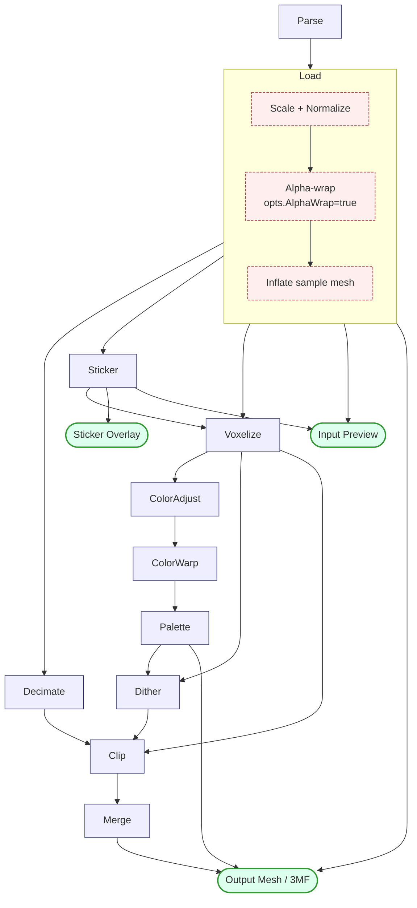

# Pipeline

The ditherforge pipeline turns an input mesh (STL / GLB / 3MF / …) into a colored, voxel-style output mesh ready for 3D printing as a 3MF. Internally it's a sequence of stages, each producing a typed output that downstream stages consume. Every stage's output is cached — in memory for the lifetime of the app, and on disk under `$UserCacheDir/ditherforge/` across app restarts.

Driven from `pipeline.RunCached` (`pipeline.go`) via `pipelineRun` (`run.go`); cache layer is `internal/diskcache`.

## Stages

| # | Name | Output | Settings struct (`stepcache.go`) |
|---|------|--------|----------------------------------|
| 0 | `Parse` | `*loader.LoadedModel` (file units, no transforms) | `parseSettings` |
| 1 | `Load` | `*loadOutput` (scaled / normalized / optionally alpha-wrapped, plus preview MeshData) | `loadSettings` |
| 2 | `Decimate` | `*decimateOutput` (decimated mesh) | `decimateSettings` |
| 3 | `Sticker` | `*stickerOutput` (per-triangle decal UVs + scratch mesh) | `stickerSettings` |
| 4 | `Voxelize` | `*voxelizeOutput` (active cells, two-grid sizing) | `voxelizeSettings` |
| 5 | `ColorAdjust` | `*colorAdjustOutput` (cells with brightness/contrast/saturation) | `colorAdjustSettings` |
| 6 | `ColorWarp` | `*colorWarpOutput` (cells with RBF pin remapping) | `colorWarpSettings` |
| 7 | `Palette` | `*paletteOutput` (palette + snapped cells) | `paletteSettings` |
| 8 | `Dither` | `*ditherOutput` (per-cell color assignment + flood-fill patches) | `ditherSettings` |
| 9 | `Clip` | `*clipOutput` (shell mesh derived from decimated geometry) | `clipSettings` |
| 10 | `Merge` | `*mergeOutput` (coplanar-triangle-merged shell) | `mergeSettings` |

Notes:

- **Alpha-wrap** is not its own cache stage — there's no `StageID` for it and no separate cache file. It's a sub-step inside `Load`'s body that takes the scaled / normalized mesh and runs CGAL alpha-wrap (when `opts.AlphaWrap` is true) before assembling `loadOutput`. The wrap result lives inside `loadOutput.Model` and is keyed by the same `loadSettings`, which already includes `AlphaWrap`, `AlphaWrapAlpha`, `AlphaWrapOffset`. Toggling alpha-wrap therefore invalidates the Load cache (and everything downstream via the cumulative cascade) but doesn't have a separate `alphawrap/` directory under the cache. From a user's perspective alpha-wrap still emits its own `"Alpha-wrap: alpha=X mm, offset=Y mm..."` console line and is visible in the diagram below as a sub-node of Load.
- Stage IDs are defined in `internal/pipeline/stepcache.go` (`StageID` enum).

## Settings per stage

A stage's cache key changes if and only if its own settings struct changes _or_ any upstream stage's key changes (cumulative cascade — see "Cache keys" below).

```text
parseSettings        = { Input, ReloadSeq, ObjectIndex }
loadSettings         = { Scale, HasSize, Size, AlphaWrap, AlphaWrapAlpha, AlphaWrapOffset }
decimateSettings     = { NoSimplify, NozzleDiameter, LayerHeight }
stickerSettings      = { Stickers, BaseColor, AlphaWrap }
voxelizeSettings     = { NozzleDiameter, LayerHeight, BaseColor }
colorAdjustSettings  = { Brightness, Contrast, Saturation }
colorWarpSettings    = { WarpPins }
paletteSettings      = { NumColors, LockedColors, InventoryFile, InventoryContents,
                         InventoryColors, InventoryLabels, ColorSnap }
ditherSettings       = { Dither }
clipSettings         = { }     ← invalidated only by dependency cascade
mergeSettings        = { NoMerge }
```

A few subtleties:

- `BaseColor` is in `voxelizeSettings` and `stickerSettings` but **not** `loadSettings`. Base color is reapplied per-run by `applyBaseColor` (`pipeline.go`); the load cache stays valid across base-color changes. Sticker invalidates because `runSticker` deep-clones `lo.ColorModel` and the per-run reapply doesn't reach into that scratch copy.
- `AlphaWrap*` lives in `loadSettings`. `stickerSettings` includes only the `AlphaWrap` boolean (the wrap geometry comes through the Load stage's cumulative cascade).
- `NozzleDiameter` and `LayerHeight` appear in both `decimateSettings` and `voxelizeSettings`. Both stages depend on the cell sizing.
- `paletteSettings.InventoryContents` is the contents of the inventory file (memoized by path/mtime/size), not just its path — so editing the file invalidates the palette cache.

## Dependencies



Solid stage-to-stage edges are direct dependencies (the producer's output is read by the consumer). The dashed sub-nodes inside `Load` are body steps, not separate cache stages — they all flow into the single `Load` cache entry.

The three "consumer" nodes are what `RunCached` actually asks for. Demand-driven evaluation (in `(r *pipelineRun).X()` methods) means a stage's body only runs if its own cache misses; on cache hit, no upstream is touched. So on a fully-warm restart, only `Load`, `Sticker`, `Palette`, and `Merge` are read from disk — the seven stages between `Sticker` and `Merge` stay cold.

## Stage descriptions

### Parse — `*loader.LoadedModel`

Reads the input file from disk and decodes it. Output is in file units, no transformations applied. Cheap to gob-serialize (one mesh, no derived state) so it persists to disk for instant restarts. Settings only depend on the file identity — `Scale`, `Size`, alpha-wrap, etc. don't invalidate it.

### Load — `*loadOutput`

Clones the parsed model, applies `Scale` × unit-scale (with optional auto-fit-to-`Size`), normalizes Z so the model bottom sits at z=0, and optionally runs CGAL alpha-wrap on top. Builds the input MeshData preview. The result has three pointers to `*loader.LoadedModel`:

- `Model` — geometry mesh (wrapped if alpha-wrap enabled, else aliases ColorModel)
- `ColorModel` — original mesh, carries UVs / textures / materials
- `SampleModel` — color-sample mesh; equals ColorModel except when alpha-wrap is on with positive offset (then it's `loader.InflateAlongNormals(ColorModel, offset)`)

`loadOutput` has a custom `GobEncode/GobDecode` (`loadoutput_persist.go`) that preserves pointer aliasing across disk round-trip.

### Decimate — `*decimateOutput`

Runs QEM mesh decimation (`squarevoxel.DecimateMesh`) on `lo.Model` to reduce triangle count to roughly the voxel grid resolution. Used by Clip to build the output shell.

### Sticker — `*stickerOutput`

For each user-placed sticker, computes per-triangle UV coordinates either by BFS-DEM + LSCM (unfold mode) or by camera projection (projection mode). The sticker output also carries a deep-cloned scratch `Model` because the BFS may subdivide pathological triangles in place — that mutation must not affect the load cache.

### Voxelize — `*voxelizeOutput`

`squarevoxel.VoxelizeTwoGrids` rasterizes `lo.Model` into a two-grid voxel structure (a coarse first-layer grid for the bottom layer, fine grids above). Each cell is colored by the nearest triangle's texture / vertex / base color. Decals from the Sticker stage are composited onto the cell colors.

### ColorAdjust / ColorWarp / Palette / Dither

Pixel-style operations on the cell array:

- `ColorAdjust` — brightness, contrast, saturation in HSL.
- `ColorWarp` — RBF Gaussian pin remapping in CIELAB (move all reds to a particular target color, etc.).
- `Palette` — k-means / locked-color palette resolution; optionally snaps cell colors toward palette by ΔE.
- `Dither` — assigns each cell to a palette index (nearest-neighbor or "dizzy" error-diffusion), then flood-fills connected same-color regions into patches.

### Clip — `*clipOutput`

Takes the decimated mesh and the dither patch map, and clips the mesh into one shell per (color-patch × layer) using `voxel.ClipMeshByPatchesTwoGrid`.

### Merge — `*mergeOutput`

Coalesces coplanar adjacent triangles in the shell to reduce face count for the 3MF output. Skipped when `opts.NoMerge` is true.

## Cache keys

Every stage's cache key is content-addressed:

```
stageKey(stage, opts)  =  sha256( Version || sha256(input_file_contents)
                                  || stageFnv(0, opts) || stageFnv(1, opts)
                                  || ... || stageFnv(stage, opts) )
truncated to 32 hex chars (128 bits).
```

`stageFnv(s, opts)` is the FNV-1a hash of stage `s`'s settings struct — exactly the fields listed in "Settings per stage" above. The cumulative cascade means changing _any_ upstream setting changes _every_ downstream stage's key automatically; there's no separate cascade-clear step. Two stages with disjoint settings still get distinct keys because their stageFnv values appear at different positions in the hash.

Stable across machines: same input file content + same Version + same settings → same key, so disk caches transfer cleanly between machines (e.g., a CI runner and a laptop).

## On-disk layout

```
$UserCacheDir/ditherforge/
├── parse/
│   ├── 7a3f8c1b…32hex.gob.zst       (zstd-compressed gob of *LoadedModel)
│   └── 7a3f8c1b…32hex.meta.json     (sidecar: { "costMs": 12345 })
├── load/
│   ├── 2e8f1a4b….gob.zst
│   └── 2e8f1a4b….meta.json
├── decimate/
├── sticker/
├── voxelize/
├── coloradjust/
├── colorwarp/
├── palette/
├── dither/
├── clip/
└── merge/
```

Each entry is a data file (zstd-compressed gob) plus an optional `.meta.json` sidecar with the wall-clock time the stage took to generate. Textures inside `*LoadedModel` are stored as raw NRGBA pixels (not PNG) — the zstd layer compresses the whole payload uniformly and avoids a redundant PNG-then-deflate cycle.

## Eviction

Sweep runs after every successful pipeline execution (guarded by an atomic `sweepInFlight` flag so it can't stack). Two phases:

1. **Age**: any entry whose newest file is older than `maxAge` (7 days) is deleted.
2. **Value**: among survivors, score each entry by

   ```
   score = (costMs / sizeBytes) * 2^(-age_since_mtime / 24h)
   ```

   Sort ascending and evict from the front until total fits within `maxBytes` (1 GiB).

The score balances three factors: more expensive to regenerate = more valuable, larger = costs more budget, older = decays exponentially. Tie-break is mtime ascending (LRU fallback for legacy zero-cost entries).

Active `.tmp-*` files from in-flight write goroutines are skipped within the age cutoff so a Sweep that runs concurrently with a write doesn't delete the temp file before its rename.

## Lifecycle

- `runStage` (`run.go`) is the generic helper every per-run stage method uses. It memoizes the body's output into `pipelineRun` and threads the value through `runStageCached` (`stepcache.go`), which on a hit emits a UI marker and a console log line (`"Loading: cache hit (disk, 312ms)"`) and on a miss times the body and async-writes the meta sidecar via `RecordCost`.
- All disk writes are tracked in a `sync.WaitGroup` on `StageCache`. `App.shutdown` calls `WaitForDiskWrites` (with a 30-second timeout) so big payloads aren't killed mid-rename when the user closes the window.
